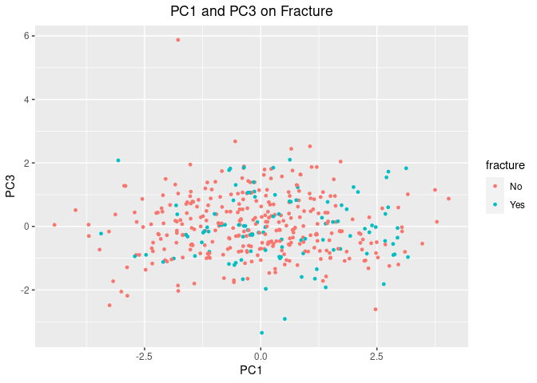

MSDS_6372_Project2
================
Tamas Toth
2022-07-26

#### Loading the necessary R libraries for the analysis

``` r
# Load the necessary libraries
library(knitr)
library(rmarkdown)
# From class
library(GGally)
library(epitools)
library(MASS)
library(tidyverse)
library(car)
library(caret)
library(glmnet)
library(ROCR)
library(pROC)
#Dasta set
library(aplore3)

# Other useful libraries
library(dplyr)
library(ggplot2)
library(gplots)

#library(ggpubr)
#library(tidyr)
#library(plyr)
#library(ggthemes)
library(e1071)
#library(class)
#library(stringr)
#library(sjPlot)
#library(data.table)
#library(reshape2)
#library(corrplot)
#library(naivebayes)
#library(egg)
#library(rworldmap)
#library(Hmisc)
#library(DataExplorer)
#library(selectiveInference)
#library(dlookr)
```

``` r
# Turn off scientific notation
options(scipen = 100, digits = 4)
```

## The Global Longitudinal Study of Osteoporosis in Women

### Objective: Assessing risk factors and predicting if a woman with osteoperosis will have a bone fracture within the first year after joining the study.

#### The study has enrolled over 60,000 women aged 55 and older in ten countries. The major goals of the study are to use the data to provide insights into the management of fracture risk, patient experience with prevention and treatment of fractures and distribution of risk factors among older women on an international scale over the follow up period. The outcome variable is any fracture in the first year of follow up. www.outcomes-umassmed.org/glow

## Objective 1 methodology:

1.  Understand the data
2.  EDA
3.  Feature Selection (Penalized Logistic Regression,
    Stepwise/forward/backward, Manual)
4.  Split the data to Training and Test set
5.  Fit Logistic Regression model
6.  Interpret the model, including hypothesis testing and confidence
    intervals
7.  Conclusion

#### Read the data

``` r
#Read the data
bonemed_df = glow_bonemed
attach(bonemed_df)
bonemed_df_sample = sample_n(bonemed_df, 5)
knitr::kable(bonemed_df_sample, "html")
```

<table>
<thead>
<tr>
<th style="text-align:right;">
sub_id
</th>
<th style="text-align:right;">
site_id
</th>
<th style="text-align:right;">
phy_id
</th>
<th style="text-align:left;">
priorfrac
</th>
<th style="text-align:right;">
age
</th>
<th style="text-align:right;">
weight
</th>
<th style="text-align:right;">
height
</th>
<th style="text-align:right;">
bmi
</th>
<th style="text-align:left;">
premeno
</th>
<th style="text-align:left;">
momfrac
</th>
<th style="text-align:left;">
armassist
</th>
<th style="text-align:left;">
smoke
</th>
<th style="text-align:left;">
raterisk
</th>
<th style="text-align:right;">
fracscore
</th>
<th style="text-align:left;">
fracture
</th>
<th style="text-align:left;">
bonemed
</th>
<th style="text-align:left;">
bonemed_fu
</th>
<th style="text-align:left;">
bonetreat
</th>
</tr>
</thead>
<tbody>
<tr>
<td style="text-align:right;">
196
</td>
<td style="text-align:right;">
1
</td>
<td style="text-align:right;">
38
</td>
<td style="text-align:left;">
No
</td>
<td style="text-align:right;">
67
</td>
<td style="text-align:right;">
66.7
</td>
<td style="text-align:right;">
155
</td>
<td style="text-align:right;">
27.76
</td>
<td style="text-align:left;">
No
</td>
<td style="text-align:left;">
No
</td>
<td style="text-align:left;">
No
</td>
<td style="text-align:left;">
No
</td>
<td style="text-align:left;">
Less
</td>
<td style="text-align:right;">
2
</td>
<td style="text-align:left;">
No
</td>
<td style="text-align:left;">
No
</td>
<td style="text-align:left;">
No
</td>
<td style="text-align:left;">
No
</td>
</tr>
<tr>
<td style="text-align:right;">
408
</td>
<td style="text-align:right;">
5
</td>
<td style="text-align:right;">
296
</td>
<td style="text-align:left;">
Yes
</td>
<td style="text-align:right;">
89
</td>
<td style="text-align:right;">
59.9
</td>
<td style="text-align:right;">
160
</td>
<td style="text-align:right;">
23.40
</td>
<td style="text-align:left;">
No
</td>
<td style="text-align:left;">
No
</td>
<td style="text-align:left;">
Yes
</td>
<td style="text-align:left;">
No
</td>
<td style="text-align:left;">
Less
</td>
<td style="text-align:right;">
9
</td>
<td style="text-align:left;">
Yes
</td>
<td style="text-align:left;">
Yes
</td>
<td style="text-align:left;">
No
</td>
<td style="text-align:left;">
No
</td>
</tr>
<tr>
<td style="text-align:right;">
484
</td>
<td style="text-align:right;">
6
</td>
<td style="text-align:right;">
305
</td>
<td style="text-align:left;">
No
</td>
<td style="text-align:right;">
61
</td>
<td style="text-align:right;">
85.7
</td>
<td style="text-align:right;">
162
</td>
<td style="text-align:right;">
32.66
</td>
<td style="text-align:left;">
Yes
</td>
<td style="text-align:left;">
No
</td>
<td style="text-align:left;">
Yes
</td>
<td style="text-align:left;">
Yes
</td>
<td style="text-align:left;">
Same
</td>
<td style="text-align:right;">
4
</td>
<td style="text-align:left;">
Yes
</td>
<td style="text-align:left;">
No
</td>
<td style="text-align:left;">
No
</td>
<td style="text-align:left;">
No
</td>
</tr>
<tr>
<td style="text-align:right;">
477
</td>
<td style="text-align:right;">
5
</td>
<td style="text-align:right;">
301
</td>
<td style="text-align:left;">
No
</td>
<td style="text-align:right;">
86
</td>
<td style="text-align:right;">
64.4
</td>
<td style="text-align:right;">
158
</td>
<td style="text-align:right;">
25.80
</td>
<td style="text-align:left;">
No
</td>
<td style="text-align:left;">
No
</td>
<td style="text-align:left;">
Yes
</td>
<td style="text-align:left;">
No
</td>
<td style="text-align:left;">
Same
</td>
<td style="text-align:right;">
8
</td>
<td style="text-align:left;">
Yes
</td>
<td style="text-align:left;">
No
</td>
<td style="text-align:left;">
Yes
</td>
<td style="text-align:left;">
No
</td>
</tr>
<tr>
<td style="text-align:right;">
91
</td>
<td style="text-align:right;">
3
</td>
<td style="text-align:right;">
141
</td>
<td style="text-align:left;">
Yes
</td>
<td style="text-align:right;">
87
</td>
<td style="text-align:right;">
61.2
</td>
<td style="text-align:right;">
160
</td>
<td style="text-align:right;">
23.91
</td>
<td style="text-align:left;">
No
</td>
<td style="text-align:left;">
Yes
</td>
<td style="text-align:left;">
Yes
</td>
<td style="text-align:left;">
No
</td>
<td style="text-align:left;">
Greater
</td>
<td style="text-align:right;">
10
</td>
<td style="text-align:left;">
No
</td>
<td style="text-align:left;">
Yes
</td>
<td style="text-align:left;">
Yes
</td>
<td style="text-align:left;">
Yes
</td>
</tr>
</tbody>
</table>

``` r
dim(bonemed_df)
```

    ## [1] 500  18

### Data Description

-   **sub_id**: Identification Code (1 - n)

-   **site_id**: Study Site (1 - 6)

-   **phy_id**: Physician ID code (128 unique codes)

-   **priorfrac**: History of Prior Fracture (1: No, 2: Yes)

-   **age**: Age at Enrollment (Years)

-   **weight**: Weight at enrollment (Kilograms)

-   **height**: Height at enrollment (Centimeters)

-   **bmi**: Body Mass Index (Kg/m^2)

-   **premeno**: Menopause before age 45 (1: No, 2: Yes)

-   **momfrac**: Mother had hip fracture (1: No, 2: Yes)

-   **armassist**: Arms are needed to stand from a chair (1: No, 2: Yes)

-   **smoke**: Former or current smoker (1: No, 2: Yes)

-   **raterisk**: Self-reported risk of fracture (1: Less than others of
    the same age, 2: Same as others of the same age, 3: Greater than
    others of the same age)

-   **fracscore**: Fracture Risk Score (Composite Risk Score)

-   **fracture**: Any fracture in first year (1: No, 2: Yes)

-   **bonemed**: Bone medications at enrollment (1: No, 2: Yes)

-   **bonemed_fu**: Bone medications at follow-up (1: No, 2: Yes)

-   **bonetreat**: Bone medications both at enrollment and follow-up (1:
    No, 2: Yes)

``` r
#set random seed
set.seed(329)
```

#### Address the missing values in each column (NA as well as empty strings).

``` r
# Address the missing values in each column (NA as well as empty strings).
missing_df = as.data.frame(sapply(bonemed_df, function(x) sum(is.na(x))))
colnames(missing_df) = c("missing values")
knitr::kable(missing_df, "html")
```

<table>
<thead>
<tr>
<th style="text-align:left;">
</th>
<th style="text-align:right;">
missing values
</th>
</tr>
</thead>
<tbody>
<tr>
<td style="text-align:left;">
sub_id
</td>
<td style="text-align:right;">
0
</td>
</tr>
<tr>
<td style="text-align:left;">
site_id
</td>
<td style="text-align:right;">
0
</td>
</tr>
<tr>
<td style="text-align:left;">
phy_id
</td>
<td style="text-align:right;">
0
</td>
</tr>
<tr>
<td style="text-align:left;">
priorfrac
</td>
<td style="text-align:right;">
0
</td>
</tr>
<tr>
<td style="text-align:left;">
age
</td>
<td style="text-align:right;">
0
</td>
</tr>
<tr>
<td style="text-align:left;">
weight
</td>
<td style="text-align:right;">
0
</td>
</tr>
<tr>
<td style="text-align:left;">
height
</td>
<td style="text-align:right;">
0
</td>
</tr>
<tr>
<td style="text-align:left;">
bmi
</td>
<td style="text-align:right;">
0
</td>
</tr>
<tr>
<td style="text-align:left;">
premeno
</td>
<td style="text-align:right;">
0
</td>
</tr>
<tr>
<td style="text-align:left;">
momfrac
</td>
<td style="text-align:right;">
0
</td>
</tr>
<tr>
<td style="text-align:left;">
armassist
</td>
<td style="text-align:right;">
0
</td>
</tr>
<tr>
<td style="text-align:left;">
smoke
</td>
<td style="text-align:right;">
0
</td>
</tr>
<tr>
<td style="text-align:left;">
raterisk
</td>
<td style="text-align:right;">
0
</td>
</tr>
<tr>
<td style="text-align:left;">
fracscore
</td>
<td style="text-align:right;">
0
</td>
</tr>
<tr>
<td style="text-align:left;">
fracture
</td>
<td style="text-align:right;">
0
</td>
</tr>
<tr>
<td style="text-align:left;">
bonemed
</td>
<td style="text-align:right;">
0
</td>
</tr>
<tr>
<td style="text-align:left;">
bonemed_fu
</td>
<td style="text-align:right;">
0
</td>
</tr>
<tr>
<td style="text-align:left;">
bonetreat
</td>
<td style="text-align:right;">
0
</td>
</tr>
</tbody>
</table>

``` r
empty_string_df = as.data.frame(sapply(bonemed_df, function(x) sum(x == "")))
colnames(empty_string_df) = c("empty string")
knitr::kable(empty_string_df, "html")
```

<table>
<thead>
<tr>
<th style="text-align:left;">
</th>
<th style="text-align:right;">
empty string
</th>
</tr>
</thead>
<tbody>
<tr>
<td style="text-align:left;">
sub_id
</td>
<td style="text-align:right;">
0
</td>
</tr>
<tr>
<td style="text-align:left;">
site_id
</td>
<td style="text-align:right;">
0
</td>
</tr>
<tr>
<td style="text-align:left;">
phy_id
</td>
<td style="text-align:right;">
0
</td>
</tr>
<tr>
<td style="text-align:left;">
priorfrac
</td>
<td style="text-align:right;">
0
</td>
</tr>
<tr>
<td style="text-align:left;">
age
</td>
<td style="text-align:right;">
0
</td>
</tr>
<tr>
<td style="text-align:left;">
weight
</td>
<td style="text-align:right;">
0
</td>
</tr>
<tr>
<td style="text-align:left;">
height
</td>
<td style="text-align:right;">
0
</td>
</tr>
<tr>
<td style="text-align:left;">
bmi
</td>
<td style="text-align:right;">
0
</td>
</tr>
<tr>
<td style="text-align:left;">
premeno
</td>
<td style="text-align:right;">
0
</td>
</tr>
<tr>
<td style="text-align:left;">
momfrac
</td>
<td style="text-align:right;">
0
</td>
</tr>
<tr>
<td style="text-align:left;">
armassist
</td>
<td style="text-align:right;">
0
</td>
</tr>
<tr>
<td style="text-align:left;">
smoke
</td>
<td style="text-align:right;">
0
</td>
</tr>
<tr>
<td style="text-align:left;">
raterisk
</td>
<td style="text-align:right;">
0
</td>
</tr>
<tr>
<td style="text-align:left;">
fracscore
</td>
<td style="text-align:right;">
0
</td>
</tr>
<tr>
<td style="text-align:left;">
fracture
</td>
<td style="text-align:right;">
0
</td>
</tr>
<tr>
<td style="text-align:left;">
bonemed
</td>
<td style="text-align:right;">
0
</td>
</tr>
<tr>
<td style="text-align:left;">
bonemed_fu
</td>
<td style="text-align:right;">
0
</td>
</tr>
<tr>
<td style="text-align:left;">
bonetreat
</td>
<td style="text-align:right;">
0
</td>
</tr>
</tbody>
</table>

``` r
# Function to Identify different characteristics of the data frame 
# Getting a concise summary of the dataframe: str()
# Listing the column labels of the dataframe: colnames()
# Size of the dataset: dim()
# # Verify if there is any negative values in the dataset
dfinfo = function(df_name)
  {
  df_structure = str(df_name)
  df_colnames = colnames(df_name)
  df_dimensions = dim(df_name)
  
  num_cols = bonemed_df %>% dplyr::select(where(is.numeric)) %>% colnames()
  df_neg = print(paste("Negative values in the variable:",  
                       sapply(bonemed_df[,num_cols], function(x) sum(x < 0))))
  
  outparam = list(df_structure, df_colnames, df_dimensions, df_neg)
  return (outparam)
}
```

``` r
dfinfo(bonemed_df)
```

    ## 'data.frame':    500 obs. of  18 variables:
    ##  $ sub_id    : int  1 2 3 4 5 6 7 8 9 10 ...
    ##  $ site_id   : int  1 4 6 6 1 5 5 1 1 4 ...
    ##  $ phy_id    : int  14 284 305 309 37 299 302 36 8 282 ...
    ##  $ priorfrac : Factor w/ 2 levels "No","Yes": 1 1 2 1 1 2 1 2 2 1 ...
    ##  $ age       : int  62 65 88 82 61 67 84 82 86 58 ...
    ##  $ weight    : num  70.3 87.1 50.8 62.1 68 68 50.8 40.8 62.6 63.5 ...
    ##  $ height    : int  158 160 157 160 152 161 150 153 156 166 ...
    ##  $ bmi       : num  28.2 34 20.6 24.3 29.4 ...
    ##  $ premeno   : Factor w/ 2 levels "No","Yes": 1 1 1 1 1 1 1 1 1 1 ...
    ##  $ momfrac   : Factor w/ 2 levels "No","Yes": 1 1 2 1 1 1 1 1 1 1 ...
    ##  $ armassist : Factor w/ 2 levels "No","Yes": 1 1 2 1 1 1 1 1 1 1 ...
    ##  $ smoke     : Factor w/ 2 levels "No","Yes": 1 1 1 1 1 2 1 1 1 1 ...
    ##  $ raterisk  : Factor w/ 3 levels "Less","Same",..: 2 2 1 1 2 2 1 2 2 1 ...
    ##  $ fracscore : int  1 2 11 5 1 4 6 7 7 0 ...
    ##  $ fracture  : Factor w/ 2 levels "No","Yes": 1 1 1 1 1 1 1 1 1 1 ...
    ##  $ bonemed   : Factor w/ 2 levels "No","Yes": 1 1 1 1 1 1 1 2 1 1 ...
    ##  $ bonemed_fu: Factor w/ 2 levels "No","Yes": 1 1 1 1 1 1 1 2 1 1 ...
    ##  $ bonetreat : Factor w/ 2 levels "No","Yes": 1 1 1 1 1 1 1 2 1 1 ...
    ## [1] "Negative values in the variable: 0" "Negative values in the variable: 0"
    ## [3] "Negative values in the variable: 0" "Negative values in the variable: 0"
    ## [5] "Negative values in the variable: 0" "Negative values in the variable: 0"
    ## [7] "Negative values in the variable: 0" "Negative values in the variable: 0"

    ## [[1]]
    ## NULL
    ## 
    ## [[2]]
    ##  [1] "sub_id"     "site_id"    "phy_id"     "priorfrac"  "age"       
    ##  [6] "weight"     "height"     "bmi"        "premeno"    "momfrac"   
    ## [11] "armassist"  "smoke"      "raterisk"   "fracscore"  "fracture"  
    ## [16] "bonemed"    "bonemed_fu" "bonetreat" 
    ## 
    ## [[3]]
    ## [1] 500  18
    ## 
    ## [[4]]
    ## [1] "Negative values in the variable: 0" "Negative values in the variable: 0"
    ## [3] "Negative values in the variable: 0" "Negative values in the variable: 0"
    ## [5] "Negative values in the variable: 0" "Negative values in the variable: 0"
    ## [7] "Negative values in the variable: 0" "Negative values in the variable: 0"

### Observations:

-   The data set is comprised of 500 observations and 18 variables
-   There are numerical and categorical variables in the data set
-   There are no missing values or empty strings in the data set
-   No negative values in the data set
-   ??????No duplicated records
-   ‘fracture’ is the dependent variable

##################################################################################### 

# Exploratory Data Analysis

##################################################################################### 

``` r
num_cols = bonemed_df %>% dplyr::select(where(is.numeric)) %>% colnames()
pair_plot = c(num_cols, 'fracture')
pair_plot = pair_plot[-1]
ggpairs(bonemed_df[,pair_plot],aes(color=fracture, alpha = 0.5))
```


### Observations:

-   Height for fracture ‘No’ and ‘Yes’ levels seem to be normally
    distributed.
-   Weight and bmi are strongly positively linearly correlated for both
    factor levels.
-   Age and fracscore are strongly positively linearly correlated for
    both factor levels.
-   There are more “No” fracture in the first year observations than
    “Yes”

``` r
# Summary statistics
t(aggregate(.~ fracture,data=bonemed_df,summary))
```

    ##                    [,1]     [,2]    
    ## fracture           "No"     "Yes"   
    ## sub_id.Min.        "  1.0"  "376.0" 
    ## sub_id.1st Qu.     " 94.5"  "407.0" 
    ## sub_id.Median      "188.0"  "438.0" 
    ## sub_id.Mean        "188.0"  "438.0" 
    ## sub_id.3rd Qu.     "281.5"  "469.0" 
    ## sub_id.Max.        "375.0"  "500.0" 
    ## site_id.Min.       "1.000"  "1.000" 
    ## site_id.1st Qu.    "2.000"  "2.000" 
    ## site_id.Median     "3.000"  "4.000" 
    ## site_id.Mean       "3.363"  "3.656" 
    ## site_id.3rd Qu.    "5.000"  "5.000" 
    ## site_id.Max.       "6.000"  "6.000" 
    ## phy_id.Min.        "  1.0"  "  7.0" 
    ## phy_id.1st Qu.     " 50.0"  " 68.0" 
    ## phy_id.Median      "172.0"  "197.0" 
    ## phy_id.Mean        "173.9"  "192.5" 
    ## phy_id.3rd Qu.     "296.0"  "300.0" 
    ## phy_id.Max.        "325.0"  "325.0" 
    ## priorfrac.Min.     "1.000"  "1.000" 
    ## priorfrac.1st Qu.  "1.000"  "1.000" 
    ## priorfrac.Median   "1.000"  "1.000" 
    ## priorfrac.Mean     "1.197"  "1.416" 
    ## priorfrac.3rd Qu.  "1.000"  "2.000" 
    ## priorfrac.Max.     "2.000"  "2.000" 
    ## age.Min.           "55.00"  "56.00" 
    ## age.1st Qu.        "60.00"  "65.00" 
    ## age.Median         "66.00"  "72.00" 
    ## age.Mean           "67.49"  "71.79" 
    ## age.3rd Qu.        "74.00"  "79.00" 
    ## age.Max.           "90.00"  "89.00" 
    ## weight.Min.        " 39.90" " 45.80"
    ## weight.1st Qu.     " 60.30" " 59.90"
    ## weight.Median      " 68.00" " 68.00"
    ## weight.Mean        " 72.17" " 70.79"
    ## weight.3rd Qu.     " 81.60" " 79.40"
    ## weight.Max.        "127.00" "124.70"
    ## height.Min.        "142.0"  "134.0" 
    ## height.1st Qu.     "158.0"  "155.0" 
    ## height.Median      "162.0"  "160.0" 
    ## height.Mean        "161.9"  "159.9" 
    ## height.3rd Qu.     "166.0"  "164.0" 
    ## height.Max.        "199.0"  "178.0" 
    ## bmi.Min.           "14.88"  "17.04" 
    ## bmi.1st Qu.        "23.32"  "23.05" 
    ## bmi.Median         "26.37"  "26.43" 
    ## bmi.Mean           "27.50"  "27.71" 
    ## bmi.3rd Qu.        "30.62"  "31.09" 
    ## bmi.Max.           "49.08"  "44.04" 
    ## premeno.Min.       "1.000"  "1.000" 
    ## premeno.1st Qu.    "1.000"  "1.000" 
    ## premeno.Median     "1.000"  "1.000" 
    ## premeno.Mean       "1.192"  "1.200" 
    ## premeno.3rd Qu.    "1.000"  "1.000" 
    ## premeno.Max.       "2.000"  "2.000" 
    ## momfrac.Min.       "1.000"  "1.000" 
    ## momfrac.1st Qu.    "1.000"  "1.000" 
    ## momfrac.Median     "1.000"  "1.000" 
    ## momfrac.Mean       "1.109"  "1.192" 
    ## momfrac.3rd Qu.    "1.000"  "1.000" 
    ## momfrac.Max.       "2.000"  "2.000" 
    ## armassist.Min.     "1.000"  "1.000" 
    ## armassist.1st Qu.  "1.000"  "1.000" 
    ## armassist.Median   "1.000"  "2.000" 
    ## armassist.Mean     "1.333"  "1.504" 
    ## armassist.3rd Qu.  "2.000"  "2.000" 
    ## armassist.Max.     "2.000"  "2.000" 
    ## smoke.Min.         "1.000"  "1.000" 
    ## smoke.1st Qu.      "1.000"  "1.000" 
    ## smoke.Median       "1.000"  "1.000" 
    ## smoke.Mean         "1.075"  "1.056" 
    ## smoke.3rd Qu.      "1.000"  "1.000" 
    ## smoke.Max.         "2.000"  "2.000" 
    ## raterisk.Min.      "1.000"  "1.000" 
    ## raterisk.1st Qu.   "1.000"  "2.000" 
    ## raterisk.Median    "2.000"  "2.000" 
    ## raterisk.Mean      "1.891"  "2.168" 
    ## raterisk.3rd Qu.   "3.000"  "3.000" 
    ## raterisk.Max.      "3.000"  "3.000" 
    ## fracscore.Min.     " 0.000" " 0.000"
    ## fracscore.1st Qu.  " 1.500" " 3.000"
    ## fracscore.Median   " 3.000" " 5.000"
    ## fracscore.Mean     " 3.317" " 4.840"
    ## fracscore.3rd Qu.  " 5.000" " 7.000"
    ## fracscore.Max.     "11.000" " 9.000"
    ## bonemed.Min.       "1.000"  "1.000" 
    ## bonemed.1st Qu.    "1.000"  "1.000" 
    ## bonemed.Median     "1.000"  "1.000" 
    ## bonemed.Mean       "1.221"  "1.368" 
    ## bonemed.3rd Qu.    "1.000"  "2.000" 
    ## bonemed.Max.       "2.000"  "2.000" 
    ## bonemed_fu.Min.    "1.000"  "1.000" 
    ## bonemed_fu.1st Qu. "1.000"  "1.000" 
    ## bonemed_fu.Median  "1.000"  "1.000" 
    ## bonemed_fu.Mean    "1.229"  "1.424" 
    ## bonemed_fu.3rd Qu. "1.000"  "2.000" 
    ## bonemed_fu.Max.    "2.000"  "2.000" 
    ## bonetreat.Min.     "1.000"  "1.000" 
    ## bonetreat.1st Qu.  "1.000"  "1.000" 
    ## bonetreat.Median   "1.000"  "1.000" 
    ## bonetreat.Mean     "1.208"  "1.320" 
    ## bonetreat.3rd Qu.  "1.000"  "2.000" 
    ## bonetreat.Max.     "2.000"  "2.000"

### Observations:

-   The minimum age for “No” fracture in the first year is 55. The
    minimum age for “Yes” fracture in the first year is 56.

-   The maximum age for “No” fracture in the first year is 99. The
    maximum age for “Yes” fracture in the first year is 89.

-   The median age for “No” fracture in the first year is 66. The median
    age for “Yes” fracture in the first year is 72.

-   The mean age for “No” fracture in the first year is 67.49. The mean
    age for “Yes” fracture in the first year is 71.79.

-   Age is a likely is good predictor of fracture in the first year
    since there is a observable difference in median and mean age of
    having a fracture.

-   The minimum weight for “No” fracture in the first year is 39.9. The
    minimum weight for “Yes” fracture in the first year is 45.8.

-   The maximum weight for “No” fracture in the first year is 127. The
    maximum weight for “Yes” fracture in the first year is 124.7.

-   The median weight for “No” fracture in the first year is 68. The
    median weight for “Yes” fracture in the first year is 68.

-   The mean weight for “No” fracture in the first year is 72.17. The
    mean weight for “Yes” fracture in the first year is 70.79.

-   Weight does not seem to be a significant variable for predicting
    fracture in the first year as the median and mean weight values are
    very similar to the factor levels.

-   The minimum height for “No” fracture in the first year is 142. The
    minimum height for “Yes” fracture in the first year is 134.

-   The maximum height for “No” fracture in the first year is 199. The
    maximum height for “Yes” fracture in the first year is 178.

-   The median height for “No” fracture in the first year is 162. The
    median height for “Yes” fracture in the first year is 160.

-   The mean height for “No” fracture in the first year is 161.9. The
    mean height for “Yes” fracture in the first year is 159.9.

-   Height seems to be a good predictor for fracture in the first year.

-   The minimum bmi for “No” fracture in the first year is 14.88. The
    minimum bmi for “Yes” fracture in the first year is 17.04.

-   The maximum bmi for “No” fracture in the first year is 49.08 The
    maximum bmi for “Yes” fracture in the first year is 44.04.

-   The median bmi for “No” fracture in the first year is 26.37. The
    median bmi for “Yes” fracture in the first year is 26.43.

-   The mean bmi for “No” fracture in the first year is 27.50. The mean
    bmi for “Yes” fracture in the first year is 27.71.

-   BMI does not seem to be a significant predictor for fracture in the
    first year.

-   The minimum Fracture Risk Score for “No” fracture in the first year
    is 0. The minimum Fracture Risk Score for “Yes” fracture in the
    first year is 0.

-   The maximum Fracture Risk Score for “No” fracture in the first year
    is 11. The maximum Fracture Risk Score for “Yes” fracture in the
    first year is 9.

-   The median Fracture Risk Score for “No” fracture in the first year
    is 3. The median Fracture Risk Score for “Yes” fracture in the first
    year is 5.

-   The mean Fracture Risk Score for “No” fracture in the first year is
    3.317. The mean Fracture Risk Score for “Yes” fracture in the first
    year is 4.840.

-   Fracture Risk Score seems to be a significant predictor for fracture
    in the first year.

##################################################################################### 

# Categorical data plots

##################################################################################### 

``` r
cat_cols = bonemed_df %>% dplyr::select(where(is.factor)) %>% colnames()

# Plot all categorical variables
for (c in cat_cols)
{
  cat_plot = bonemed_df %>% ggplot(aes(x= .data[[c]], group = 1)) + 
    geom_bar(aes(y = ..prop.., fill = factor(..x..)), stat="count") +
    geom_text(aes( label = scales::percent(..prop..),
                   y= ..prop.. ), stat= "count", vjust = -.5) +
    labs(y = "Percent") +
    scale_y_continuous(labels = scales::percent) + theme(legend.position = "none") +
    ggtitle(paste(c, "Categorical Analysis")) + 
    theme(plot.title = element_text(hjust = 0.5)) + 
    theme(axis.text.x = element_text(vjust = 0.5, hjust=1)) # +
    egg::ggarrange(cat_plot, ncol=2) 
}
```


### Observations:

-   75% of the observations have no prior history of fracture. 25% of
    the observations have prior history of fracture.
-   81% of the observations have no menopause before age 45. 19% of the
    observations have menopause before age 45.
-   87% of the subjects’ mother had no hip fracture. 13% of the
    subjects’ mother had hip fracture.
-   62% of the subjects do not need arms to stand from a chair. 38% of
    the subjects need arms to stand from a chair.
-   93% of the subjects don’t smoke. 7% of the subjects smoke are former
    or current smoker.
-   33.4% of the subjects reported less risk of fractures than others of
    the same age. 37.2% of the subjects reported the same risk of
    fractures than others of the same age. 29.4% of the subjects
    reported greater risk of fractures than others of the same age.
-   75% of the patients do not have any fractures in first year. 25% of
    the patients have any fractures in first year.
-   74% of the subjects have enrolled to Bone medications. 26% of the
    subjects have not enrolled to Bone medications.
-   72% of the subjects did not require bone medications at follow-up.
    28% of the subjects required bone medications at follow-up.
-   76% of the patients did not receive bone medications at either
    enrollment or follow-up. 24% of the patients received bone
    medications both at enrollment and follow-up.

##################################################################################### 

# Bi-variate analysis with Fracture variable

##################################################################################### 

``` r
num_cols = bonemed_df %>% dplyr::select(where(is.numeric)) %>% colnames()
bivar_plot = num_cols[c(-1, -2, -3)]


for (i in bivar_plot)
{
multibox = bonemed_df %>%
  ggplot(aes(x=fracture, y = .data[[i]])) +
  geom_boxplot(fill = "sandybrown", color = "black") + 
  xlab("Fracture") +
  ylab(i) + stat_summary(fun=mean, geom="point", shape=20, size=7, color="red", fill="red") +
  ggtitle(paste(i, "vs Fracture bi-variate analysis")) +
  theme(plot.title = element_text(hjust = 0.5)) +
  scale_fill_brewer(palette = "Oranges")  
egg::ggarrange(multibox, ncol=2)
}
```


### Observations:

-   We can see an increasing in median and mean age for those who had
    any fractures in the first year.
-   Median and mean weight for both fracture levels are very similar.
-   The median and mean height are lower for those who had fracture in
    the first year. This is likely because the bone density is reduced
    and the subjects shrunk.
-   Median and mean BMI is very similar for both factor levels.
-   The mean and median fracture risk score is higher for those who had
    any fracture in the first year.

##################################################################################### 

# Correlation plot

##################################################################################### 

``` r
corr_df = bonemed_df[,c('age', 'weight', 'height', 'bmi', 'fracscore')]
cont_var.cor = cor(corr_df)
heatmap.2(cont_var.cor,col=redgreen(75), 
          density.info="none", trace="none", dendrogram=c("row"), 
          symm=F,symkey=T,symbreaks=T, scale="none")
```

<!-- -->

### Observations:

-   weight and bmi are more similar to each other therefore they would
    form a cluster
-   height, weight and bmi are also similar but more distant from each
    other. Still can form a cluster.
-   age and fracscore are also similar to each other and can form a
    cluster

``` r
# Label encoding Yes=1; No=0
bonemed_df$fracture.num<-ifelse(bonemed_df$fracture=="Yes",1,0)
```

##################################################################################### 

# Loess plots

##################################################################################### 

``` r
num_cols = bonemed_df %>% dplyr::select(where(is.numeric)) %>% colnames()
loess_plot = num_cols[c(-1, -2, -3, -9)]

for (i in loess_plot)
{
loess = bonemed_df %>% 
ggplot(aes(x=.data[[i]],y=fracture.num))+
geom_point()+
geom_smooth(formula = y ~ x, method="loess")+
theme(plot.title = element_text(hjust = 0.5)) +
ggtitle(paste(i, "vs fracture loess smoothing"))
egg::ggarrange(loess, ncol=2)
}
```

<!-- --><!-- --><!-- --><!-- --><!-- -->

### Observations:

-   The Loess plots show the ‘height’ has an S curve like logistic
    model. The curve is trending down.
-   The other continuous predictors don’t seem to be important
    predicting fracture in the first year.

##################################################################################### 

# Loess plots to investigate interactions

##################################################################################### 

``` r
num_cols = bonemed_df %>% dplyr::select(where(is.numeric)) %>% colnames()
loess_plot = num_cols[c(-1, -2, -3, -9)]

for (j in cat_cols)
{
  for (i in loess_plot)
  {
  plot1 = ggplot(bonemed_df,aes(x=.data[[i]],y=fracture.num,colour=.data[[j]]))+geom_point()+
  theme(plot.title = element_text(hjust = 0.5)) +
  ggtitle(paste(i, "&", j, " interaction with fracture"))+
  geom_smooth(formula = y ~ x, method="loess",size=1,span=1.5)+facet_wrap(~.data[[j]])
  ylim(-.2,1.2)
  show(plot1)
  }
}
```

<!-- --><!-- --><!-- --><!-- --><!-- --><!-- --><!-- --><!-- --><!-- --><!-- --><!-- --><!-- --><!-- --><!-- --><!-- --><!-- --><!-- --><!-- --><!-- --><!-- --><!-- --><!-- --><!-- --><!-- --><!-- --><!-- --><!-- --><!-- --><!-- --><!-- --><!-- --><!-- --><!-- --><!-- --><!-- --><!-- --><!-- --><!-- --><!-- --><!-- --><!-- --><!-- --><!-- --><!-- --><!-- --><!-- --><!-- --><!-- --><!-- --><!-- -->

## Observations:

-   There is a interaction with weight and priorfrac
-   There is a interaction with bmi and priorfrac
-   There is a interaction with fracscore and priorfrac
-   There is a interaction with weight and raterisk
-   There is a interaction with bmi and raterisk
-   There is a interaction with weight and bonemed
-   There is a interaction with bmi and bonemed
-   There is a interaction with weight and bonemed_fu
-   There is a interaction with bmi and bonemed_fu
-   There is a interaction with weight and bonetreat
-   There is a interaction with bmi and bonetreat

##################################################################################### 

# Split the Data to Train and Test sets (85%-15%)

##################################################################################### 

``` r
bonmed_df_split = bonemed_df[,-c(1, 2, 3)]
index<-sample(1:dim(bonmed_df_split)[1],round(dim(bonmed_df_split)[1]*0.85),replace=F)
train = bonmed_df_split[index,]
test = bonmed_df_split[-index,]
```

##################################################################################### 

# Feature Selection

##################################################################################### 

## Manual / Intuition selection

``` r
# Fit each variable separately and check the p-value for significance

# priorfrac
simple.log.priorfrac<-glm(fracture~priorfrac,family=binomial(link='logit'),data=train)
simple.log.priorfrac.sum = summary(simple.log.priorfrac)

# age
simple.log.age<-glm(fracture~age,family=binomial(link='logit'),data=train)
simple.log.age.sum = summary(simple.log.age)

# weight
simple.log.weight<-glm(fracture~weight,family=binomial(link='logit'),data=train)
simple.log.weight.sum = summary(simple.log.weight)

# height
simple.log.height<-glm(fracture~height,family=binomial(link='logit'),data=train)
simple.log.height.sum = summary(simple.log.height)

# bmi
simple.log.bmi<-glm(fracture~bmi,family=binomial(link='logit'),data=train)
simple.log.bmi.sum = summary(simple.log.bmi)

# premeno
simple.log.premeno<-glm(fracture~premeno,family=binomial(link='logit'),data=train)
simple.log.premeno.sum = summary(simple.log.premeno)

# momfrac
simple.log.momfrac<-glm(fracture~momfrac,family=binomial(link='logit'),data=train)
simple.log.momfrac.sum = summary(simple.log.momfrac)

# armassist
simple.log.armassist<-glm(fracture~armassist,family=binomial(link='logit'),data=train)
simple.log.armassist.sum = summary(simple.log.armassist)

# smoke
simple.log.smoke<-glm(fracture~smoke,family=binomial(link='logit'),data=train)
simple.log.smoke.sum = summary(simple.log.smoke)

# raterisk
simple.log.raterisk<-glm(fracture~raterisk,family=binomial(link='logit'),data=train)
simple.log.raterisk.sum = summary(simple.log.raterisk)

# fracscore
simple.log.fracscore<-glm(fracture~fracscore,family=binomial(link='logit'),data=train)
simple.log.fracscore.sum = summary(simple.log.fracscore)

# bonemed
simple.log.bonemed<-glm(fracture~bonemed,family=binomial(link='logit'),data=train)
simple.log.bonemed.sum = summary(simple.log.bonemed)

# bonemed_fu
simple.log.bonemed_fu<-glm(fracture~bonemed_fu,family=binomial(link='logit'),data=train)
simple.log.bonemed_fu.sum = summary(simple.log.bonemed_fu)

# bonetreat
simple.log.bonetreat<-glm(fracture~bonetreat,family=binomial(link='logit'),data=train)
simple.log.bonetreat.sum = summary(simple.log.bonetreat)
```

``` r
# priorfrac
simple.log.priorfrac.sum$coefficients
```

    ##              Estimate Std. Error z value                      Pr(>|z|)
    ## (Intercept)    -1.426     0.1414 -10.081 0.000000000000000000000006714
    ## priorfracYes    1.060     0.2437   4.349 0.000013666179481153440988849

``` r
# age
simple.log.age.sum$coefficients
```

    ##             Estimate Std. Error z value    Pr(>|z|)
    ## (Intercept) -4.05002    0.89623  -4.519 0.000006215
    ## age          0.04231    0.01267   3.340 0.000838153

``` r
# weight
simple.log.weight.sum$coefficients
```

    ##              Estimate Std. Error z value Pr(>|z|)
    ## (Intercept) -0.683674   0.509143 -1.3428   0.1793
    ## weight      -0.006016   0.006976 -0.8623   0.3885

``` r
# height
simple.log.height.sum$coefficients
```

    ##             Estimate Std. Error z value Pr(>|z|)
    ## (Intercept)  4.71146    2.99392   1.574  0.11556
    ## height      -0.03618    0.01862  -1.943  0.05201

``` r
# bmi
simple.log.bmi.sum$coefficients
```

    ##              Estimate Std. Error z value Pr(>|z|)
    ## (Intercept) -1.028066    0.53698 -1.9145  0.05555
    ## bmi         -0.003128    0.01905 -0.1642  0.86959

``` r
# premeno
simple.log.premeno.sum$coefficients
```

    ##             Estimate Std. Error z value                  Pr(>|z|)
    ## (Intercept)  -1.1585     0.1274 -9.0960 0.00000000000000000009368
    ## premenoYes    0.2094     0.2721  0.7698 0.44142454587949042643658

``` r
# momfrac
simple.log.momfrac.sum$coefficients
```

    ##             Estimate Std. Error z value                    Pr(>|z|)
    ## (Intercept)  -1.1901     0.1224  -9.720 0.0000000000000000000002478
    ## momfracYes    0.5541     0.3162   1.753 0.0796758824434630613664510

``` r
# armassist
simple.log.armassist.sum$coefficients
```

    ##              Estimate Std. Error z value                  Pr(>|z|)
    ## (Intercept)   -1.4100     0.1547  -9.116 0.00000000000000000007797
    ## armassistYes   0.7075     0.2283   3.098 0.00194505752636372152529

``` r
# smoke
simple.log.smoke.sum$coefficients
```

    ##             Estimate Std. Error z value                   Pr(>|z|)
    ## (Intercept)  -1.1054     0.1165 -9.4848 0.000000000000000000002429
    ## smokeYes     -0.1268     0.4451 -0.2848 0.775814948711020968552532

``` r
# raterisk
simple.log.raterisk.sum$coefficients
```

    ##                 Estimate Std. Error z value         Pr(>|z|)
    ## (Intercept)      -1.6603     0.2275  -7.299 0.00000000000029
    ## rateriskSame      0.5443     0.2944   1.849 0.06449595109024
    ## rateriskGreater   1.0256     0.2941   3.487 0.00048859486001

``` r
# fracscore
simple.log.fracscore.sum$coefficients
```

    ##             Estimate Std. Error z value               Pr(>|z|)
    ## (Intercept)  -2.0098    0.23573  -8.526 0.00000000000000001518
    ## fracscore     0.2237    0.04786   4.674 0.00000294956575793599

``` r
# bonemed
simple.log.bonemed.sum$coefficients
```

    ##             Estimate Std. Error z value                  Pr(>|z|)
    ## (Intercept)  -1.2609     0.1354  -9.312 0.00000000000000000001254
    ## bonemedYes    0.5258     0.2462   2.136 0.03269847370748939913154

``` r
# bonemed_fu
simple.log.bonemed_fu.sum$coefficients
```

    ##               Estimate Std. Error z value                   Pr(>|z|)
    ## (Intercept)    -1.3383     0.1404  -9.529 0.000000000000000000001584
    ## bonemed_fuYes   0.7211     0.2393   3.013 0.002584333250422946558211

``` r
# bonetreat
simple.log.bonetreat.sum$coefficients
```

    ##              Estimate Std. Error z value                  Pr(>|z|)
    ## (Intercept)   -1.2119     0.1315  -9.214 0.00000000000000000003148
    ## bonetreatYes   0.3936     0.2556   1.540 0.12358095157835313759875

### Observations:

-   We can see that the following variables are statistically
    significant since p-value \< 0.05:

1.  priorfracYes
2.  age
3.  height
4.  armassistYes
5.  rateriskSame
6.  rateriskGreater
7.  fracscore
8.  bonemedYes
9.  bonemed_fuYes
10. bonetreatYes

This result is in-line with what we have observed through EDA for the
continuous variables. Next, let’s fit all the variables and observe the
effect and see how it is changing the significance of the predictors.

## Fit all variables at the same time to check effects

``` r
multi_var.log<-glm(fracture~priorfrac+age+weight+height+bmi+premeno+momfrac+armassist+smoke+raterisk+fracscore+bonemed+
                     bonemed_fu+bonetreat,family=binomial(link='logit'),data=train)
multi_var.log.sum = summary(multi_var.log)
multi_var.log.sum$coefficients
```

    ##                   Estimate Std. Error  z value Pr(>|z|)
    ## (Intercept)     -18.133928   13.63463 -1.32999 0.183522
    ## priorfracYes      0.693635    0.43776  1.58451 0.113078
    ## age               0.024911    0.06172  0.40360 0.686508
    ## weight           -0.137226    0.09619 -1.42657 0.153703
    ## height            0.087262    0.08622  1.01210 0.311488
    ## bmi               0.362430    0.25094  1.44428 0.148661
    ## premenoYes        0.253407    0.30653  0.82669 0.408416
    ## momfracYes        0.607017    0.46222  1.31327 0.189093
    ## armassistYes      0.436793    0.66987  0.65205 0.514366
    ## smokeYes         -0.183912    0.58058 -0.31677 0.751416
    ## rateriskSame      0.363463    0.31503  1.15373 0.248609
    ## rateriskGreater   0.674468    0.33738  1.99911 0.045597
    ## fracscore         0.008364    0.30805  0.02715 0.978340
    ## bonemedYes        1.332603    0.68927  1.93336 0.053192
    ## bonemed_fuYes     1.292946    0.52379  2.46845 0.013570
    ## bonetreatYes     -2.399374    0.87892 -2.72990 0.006335

### Observations:

-   Fitting all variables to the logistic regression model, it shows
    that only ‘rateriskGreater’, ‘bonmed’, ‘bonemed_fu’ and ‘bonetreat’
    are statistically significant.

Let’s test other feature selection methods as well.

## Stepwise selection

``` r
bonemed_df.step = train[,c('priorfrac', 'age', 'weight', 'height', 'bmi', 'premeno', 'momfrac', 'armassist', 'smoke', 'raterisk', 'fracscore', 
                                'bonemed', 'bonemed_fu', 'bonetreat', 'fracture')]
step.full.log = glm(fracture~.,family=binomial(link='logit'),data=bonemed_df.step)
step.log = step.full.log %>% stepAIC(trace=FALSE)
```

``` r
summary(step.log)
```

    ## 
    ## Call:
    ## glm(formula = fracture ~ priorfrac + age + weight + bmi + momfrac + 
    ##     armassist + raterisk + bonemed + bonemed_fu + bonetreat, 
    ##     family = binomial(link = "logit"), data = bonemed_df.step)
    ## 
    ## Deviance Residuals: 
    ##    Min      1Q  Median      3Q     Max  
    ## -1.526  -0.726  -0.555  -0.346   2.254  
    ## 
    ## Coefficients:
    ##                 Estimate Std. Error z value Pr(>|z|)   
    ## (Intercept)      -3.9663     1.4369   -2.76   0.0058 **
    ## priorfracYes      0.6735     0.2721    2.48   0.0133 * 
    ## age               0.0238     0.0155    1.54   0.1245   
    ## weight           -0.0442     0.0223   -1.98   0.0479 * 
    ## bmi               0.1217     0.0606    2.01   0.0444 * 
    ## momfracYes        0.6283     0.3486    1.80   0.0715 . 
    ## armassistYes      0.4734     0.2741    1.73   0.0842 . 
    ## rateriskSame      0.3758     0.3123    1.20   0.2289   
    ## rateriskGreater   0.6845     0.3360    2.04   0.0416 * 
    ## bonemedYes        1.3057     0.6881    1.90   0.0578 . 
    ## bonemed_fuYes     1.2774     0.5208    2.45   0.0142 * 
    ## bonetreatYes     -2.3827     0.8787   -2.71   0.0067 **
    ## ---
    ## Signif. codes:  0 '***' 0.001 '**' 0.01 '*' 0.05 '.' 0.1 ' ' 1
    ## 
    ## (Dispersion parameter for binomial family taken to be 1)
    ## 
    ##     Null deviance: 475.22  on 424  degrees of freedom
    ## Residual deviance: 423.79  on 413  degrees of freedom
    ## AIC: 447.8
    ## 
    ## Number of Fisher Scoring iterations: 4

``` r
exp(cbind("Odds ratio" = coef(step.log), confint.default(step.log, level = 0.95)))
```

    ##                 Odds ratio    2.5 %  97.5 %
    ## (Intercept)        0.01894 0.001133  0.3167
    ## priorfracYes       1.96112 1.150618  3.3425
    ## age                1.02410 0.993453  1.0557
    ## weight             0.95677 0.915787  0.9996
    ## bmi                1.12946 1.003051  1.2718
    ## momfracYes         1.87435 0.946554  3.7116
    ## armassistYes       1.60538 0.938085  2.7473
    ## rateriskSame       1.45613 0.789516  2.6856
    ## rateriskGreater    1.98272 1.026292  3.8305
    ## bonemedYes         3.69013 0.957843 14.2164
    ## bonemed_fuYes      3.58715 1.292440  9.9561
    ## bonetreatYes       0.09230 0.016492  0.5166

``` r
vif(step.log)
```

    ##              GVIF Df GVIF^(1/(2*Df))
    ## priorfrac   1.129  1           1.062
    ## age         1.351  1           1.162
    ## weight      9.658  1           3.108
    ## bmi         9.252  1           3.042
    ## momfrac     1.042  1           1.021
    ## armassist   1.282  1           1.132
    ## raterisk    1.229  2           1.053
    ## bonemed     6.924  1           2.631
    ## bonemed_fu  4.155  1           2.038
    ## bonetreat  10.550  1           3.248

## Obseravtions:

-   Running a stepwise selection to identify the predictors the process
    is selecting:
-   priorfrac
-   age
-   weight
-   bmi
-   momfrac
-   armassist
-   raterisk
-   bonemed
-   bonemed_fu
-   bonetreat

## PCA

``` r
# Let's use PCA to see if the continuous variables separate or not

num_cols = train %>% dplyr::select(where(is.numeric)) %>% colnames()
pca_var = num_cols[c(-6)]
pca_df = train[pca_var]

pc.result=prcomp(pca_df,scale.=TRUE)
pc.scores=pc.result$x
pc.scores=data.frame(pc.scores)
pc.scores$fracture=train$fracture

#plot the first few pc's
ggplot(data = pc.scores, aes(x = PC1, y = PC2)) +
  geom_point(aes(col=fracture), size=1)+
  theme(plot.title = element_text(hjust = 0.5))+
  ggtitle("PC1 and PC2 on Fracture")
```

<!-- -->

``` r
# Let's check lower PCs
ggplot(data = pc.scores, aes(x = PC1, y = PC3)) +
  geom_point(aes(col=fracture), size=1)+
  theme(plot.title = element_text(hjust = 0.5))+
  ggtitle("PC1 and PC3 on Fracture")
```

<!-- -->

``` r
ggplot(data = pc.scores, aes(x = PC1, y = PC4)) +
  geom_point(aes(col=fracture), size=1)+
  theme(plot.title = element_text(hjust = 0.5))+
  ggtitle("PC1 and PC4 on Fracture")
```

<!-- -->

``` r
ggplot(data = pc.scores, aes(x = PC1, y = PC5)) +
  geom_point(aes(col=fracture), size=1)+
  theme(plot.title = element_text(hjust = 0.5))+
  ggtitle("PC1 and PC5 on Fracture")
```

<!-- -->

``` r
ggplot(data = pc.scores, aes(x = PC2, y = PC3)) +
  geom_point(aes(col=fracture), size=1)+
  theme(plot.title = element_text(hjust = 0.5))+
  ggtitle("PC2 and PC3 on Fracture")
```

<!-- -->

``` r
ggplot(data = pc.scores, aes(x = PC2, y = PC4)) +
  geom_point(aes(col=fracture), size=1)+
  theme(plot.title = element_text(hjust = 0.5))+
  ggtitle("PC2 and PC4 on Fracture")
```

<!-- -->

``` r
ggplot(data = pc.scores, aes(x = PC2, y = PC5)) +
  geom_point(aes(col=fracture), size=1)+
  theme(plot.title = element_text(hjust = 0.5))+
  ggtitle("PC2 and PC5 on Fracture")
```

<!-- -->

``` r
ggplot(data = pc.scores, aes(x = PC3, y = PC4)) +
  geom_point(aes(col=fracture), size=1)+
  theme(plot.title = element_text(hjust = 0.5))+
  ggtitle("PC3 and PC4 on Fracture")
```

<!-- -->

``` r
ggplot(data = pc.scores, aes(x = PC3, y = PC5)) +
  geom_point(aes(col=fracture), size=1)+
  theme(plot.title = element_text(hjust = 0.5))+
  ggtitle("PC3 and PC5 on Fracture")
```

<!-- -->

``` r
ggplot(data = pc.scores, aes(x = PC4, y = PC5)) +
  geom_point(aes(col=fracture), size=1)+
  theme(plot.title = element_text(hjust = 0.5))+
  ggtitle("PC4 and PC5 on Fracture")
```

<!-- -->

``` r
par(mfrow=c(1,2))
eigenvals = (pc.result$sdev)^2
plot(1:5,eigenvals/sum(eigenvals),type="l",main="Scree Plot",ylab="Prop. Var. Explained")
cumulative.prop = cumsum(eigenvals/sum(eigenvals))
plot(1:5,cumulative.prop,type="l",main="Cumulative proportion",ylim=c(0,1))
```

<!-- -->

``` r
for (i in colnames(pc.scores))
{
loess_pca = pc.scores %>% 
ggplot(aes(x=.data[[i]],y=train$fracture.num))+
geom_point()+
geom_smooth(formula = y ~ x, method="loess")+
theme(plot.title = element_text(hjust = 0.5)) +
ggtitle(paste(i, " test"))
egg::ggarrange(loess_pca, ncol=2)
}
```

<!-- --><!-- --><!-- --><!-- --><!-- --><!-- -->

## Observations:

-   The levels in the PCA graph are completely intermixed. There is no
    obvious separation in the PCA.
-   The Scree Plot shows that if we include PC1 that will explain \~50%
    of the variation of the dataset
-   The cumulative proportion plot helps us see that PC1, PC2, PC3
    combined explains the variation \~98% but if we add PC4 than 100% of
    the variation is explained.
-   This lets us conclude that we need ‘age’, ‘weight’, ‘height’ and
    ‘bmi’ to explain 100% of the variation in the data.
-   The loess plot of PCA shows that PC3 is the only continous variable
    which could be important for predicting fracture in the first year.

## Penalized logistic regression (LASSO)

``` r
# Dummy code categorical predictor variables
x = model.matrix(fracture~., train)[,-c(1,17)]

# Convert the outcome (class) to a numerical variable
y <- train$fracture.num
```

``` r
# 5-fold cross validation
cv.lasso <- trainControl(
  method = "repeatedcv", 
  number = 5,
  repeats = 10,
  savePredictions = TRUE,
  summaryFunction=mnLogLoss,
  classProbs = TRUE
)

lasso.logreg.mod = train(
  fracture ~  priorfrac+age+weight+height+bmi+premeno+momfrac+armassist+smoke+raterisk+fracscore+bonemed+bonemed_fu+bonetreat,
  data = train,
  method = "glmnet",
  family = "binomial",
  trControl = cv.lasso,
  metric = "logLoss")

plot(lasso.logreg.mod)
```

<!-- -->

``` r
coef(lasso.logreg.mod$finalModel,lasso.logreg.mod$finalModel$lambdaOpt)
```

    ## 16 x 1 sparse Matrix of class "dgCMatrix"
    ##                        s1
    ## (Intercept)      0.732224
    ## priorfracYes     0.557229
    ## age              0.012451
    ## weight           .       
    ## height          -0.024412
    ## bmi              0.007827
    ## premenoYes       0.220002
    ## momfracYes       0.454743
    ## armassistYes     0.286040
    ## smokeYes        -0.188766
    ## rateriskSame     0.229086
    ## rateriskGreater  0.538811
    ## fracscore        0.066865
    ## bonemedYes       0.281776
    ## bonemed_fuYes    0.634608
    ## bonetreatYes    -0.664698

``` r
# Final LASSO model refit with glm
lasso.mod.final=glm(fracture ~  priorfrac+age+height+bmi+premeno+momfrac+armassist+smoke+raterisk+fracscore+bonemed+bonemed_fu+bonetreat, 
                    family = binomial(link='logit'), data = train)

# ODD ratios for interpretation
exp(cbind("Odds ratio" = coef(lasso.mod.final), confint.default(lasso.mod.final, level = 0.95)))
```

    ##                 Odds ratio     2.5 %    97.5 %
    ## (Intercept)        1.60328 0.0003268 7866.2868
    ## priorfracYes       2.11474 0.9041502    4.9462
    ## age                1.04180 0.9250458    1.1733
    ## height             0.96697 0.9279790    1.0076
    ## bmi                1.00532 0.9560903    1.0571
    ## premenoYes         1.34561 0.7408388    2.4441
    ## momfracYes         2.00296 0.8144679    4.9257
    ## armassistYes       1.78151 0.4875957    6.5090
    ## smokeYes           0.89045 0.2867205    2.7654
    ## rateriskSame       1.40975 0.7615568    2.6097
    ## rateriskGreater    1.93647 1.0026499    3.7400
    ## fracscore          0.92898 0.5141892    1.6784
    ## bonemedYes         3.84105 1.0055283   14.6726
    ## bonemed_fuYes      3.63421 1.2991604   10.1662
    ## bonetreatYes       0.09057 0.0163061    0.5031

## Observations and interpretations of the LASSO coeffficients:

##################################################################################### 

# Predictions

##################################################################################### 

``` r
# VIF score function
vif_score = function(model_name)
{
  vif_values = vif(model_name)[,3]
  barplot(vif_values, main = 'VIF Values', horiz = TRUE, col="blue", xlim = c(0,12))
  abline(v=10, col="red")
  return (vif_values)
}
```

``` r
y.test = model.matrix(fracture~., test)[,-c(1,17)]
```

##################################################################################### 

# LASSO

##################################################################################### 

``` r
# Predicting on the final LASSO model TRAINing data
lasso.mod.final.pred.train <- predict(lasso.mod.final, newdata = train, type = "response")

# Predicting on the final LASSO model TEST data
lasso.mod.final.pred.test <- predict(lasso.mod.final, newdata = test, type = "response")

################ LASSO ROC Curve ######################################

lasso.roc.test = prediction(lasso.mod.final.pred.test, test$fracture,label.ordering=c("No","Yes"))
roc.lasso.test = performance(lasso.roc.test, measure = "tpr", x.measure = "fpr")
plot(roc.lasso.test,colorize = TRUE)
abline(a=0, b= 1)
```

<!-- -->

``` r
AUC = auc(test$fracture, lasso.mod.final.pred.test)
```

    ## Setting levels: control = No, case = Yes

    ## Setting direction: controls < cases

``` r
print(paste("Area Under the Cuve: ", AUC))
```

    ## [1] "Area Under the Cuve:  0.83"

``` r
#alternative approach
lasso.roc<-roc(response=test$fracture,predictor=lasso.mod.final.pred.test,levels=c("No","Yes"))
```

    ## Setting direction: controls < cases

``` r
plot(lasso.roc,print.thres="best") #This graph is nice because the x axis is plotted in terms of specificity rather than FPR
```

<!-- -->

``` r
auc(lasso.roc)
```

    ## Area under the curve: 0.83

``` r
cutoff.lasso = 0.212

# Confusion matrix train
class.lasso.final.train = factor(ifelse(lasso.mod.final.pred.train>cutoff.lasso,"Yes","No"),levels=c("No","Yes"))

#Confusion Matrix for LASSO
print("Confusion matrix for LASSO TRAINING")
```

    ## [1] "Confusion matrix for LASSO TRAINING"

``` r
confusionMatrix(table(class.lasso.final.train,train$fracture), positive = "Yes")
```

    ## Confusion Matrix and Statistics
    ## 
    ##                        
    ## class.lasso.final.train  No Yes
    ##                     No  191  38
    ##                     Yes 129  67
    ##                                          
    ##                Accuracy : 0.607          
    ##                  95% CI : (0.559, 0.654) 
    ##     No Information Rate : 0.753          
    ##     P-Value [Acc > NIR] : 1              
    ##                                          
    ##                   Kappa : 0.182          
    ##                                          
    ##  Mcnemar's Test P-Value : 0.0000000000033
    ##                                          
    ##             Sensitivity : 0.638          
    ##             Specificity : 0.597          
    ##          Pos Pred Value : 0.342          
    ##          Neg Pred Value : 0.834          
    ##              Prevalence : 0.247          
    ##          Detection Rate : 0.158          
    ##    Detection Prevalence : 0.461          
    ##       Balanced Accuracy : 0.617          
    ##                                          
    ##        'Positive' Class : Yes            
    ## 

``` r
################ Misclassification rate train ######################################
#cross.table.lasso.train = table(table(class.lasso.final.train,train$fracture))
#MCR_lasso.train = (cross.table.lasso.train[2]+cross.table.lasso.train[3])/dim(train)[1]
misClasificError.lasso.train = mean(class.lasso.final.train != train$fracture)
print(paste('Misclassification Rate for lasso on training set: ', misClasificError.lasso.train))
```

    ## [1] "Misclassification Rate for lasso on training set:  0.392941176470588"

``` r
#####################################################################################################

# Confusion matrix test
class.lasso.final.test<-factor(ifelse(lasso.mod.final.pred.test>cutoff.lasso,"Yes","No"),levels=c("No","Yes"))

#Confusion Matrix for LASSO
print("Confusion matrix for LASSO TEST with 0.5 cutoff")
```

    ## [1] "Confusion matrix for LASSO TEST with 0.5 cutoff"

``` r
confusionMatrix(table(class.lasso.final.test,test$fracture), positive = "Yes")
```

    ## Confusion Matrix and Statistics
    ## 
    ##                       
    ## class.lasso.final.test No Yes
    ##                    No  38   3
    ##                    Yes 17  17
    ##                                         
    ##                Accuracy : 0.733         
    ##                  95% CI : (0.619, 0.829)
    ##     No Information Rate : 0.733         
    ##     P-Value [Acc > NIR] : 0.55981       
    ##                                         
    ##                   Kappa : 0.442         
    ##                                         
    ##  Mcnemar's Test P-Value : 0.00365       
    ##                                         
    ##             Sensitivity : 0.850         
    ##             Specificity : 0.691         
    ##          Pos Pred Value : 0.500         
    ##          Neg Pred Value : 0.927         
    ##              Prevalence : 0.267         
    ##          Detection Rate : 0.227         
    ##    Detection Prevalence : 0.453         
    ##       Balanced Accuracy : 0.770         
    ##                                         
    ##        'Positive' Class : Yes           
    ## 

``` r
################ Misclassification rate test ######################################
#cross.table.lasso.test = table(class.lasso.final.test,test$fracture)
#MCR_lasso.test = (cross.table.lasso.test[2]+cross.table.lasso.test[3])/dim(test)[1]
#print(paste('Misclassification Rate for LASSO selection on test set: ', MCR_lasso.test))
misClasificError.lasso.test = mean(class.lasso.final.test != test$fracture)
print(paste('Misclassification Rate for lasso on test set: ', misClasificError.lasso.test))
```

    ## [1] "Misclassification Rate for lasso on test set:  0.266666666666667"

## Assumprions

``` r
# Checking logistic regression model assumptions

# The Observations are Independent
# We can assume that the observations are not coming from repeated measures

#There is No Multicollinearity Among Explanatory Variables
### Visualize VIF
#vif_score(lasso.mod)


# There are No Extreme Outliers (cooks D)
#influenceIndexPlot(lasso.mod)

# There is a Linear Relationship Between Explanatory Variables and the Logit of the Response Variable

# Influential point analysis and residual plots
#residualPlots(lasso.mod)
#influenceIndexPlot(lasso.mod)
#influencePlot(lasso.mod)
```

## Observations:

## All assumptions are met:

-   **The Response Variable is Binary**: ‘Fracture’ as a response
    variable is a factor with binary levels (Yes/No)

-   **Independence**: We can assume that the observations are
    independent

-   **Multicolliearity**: The is no multicollinearity among the
    explanatory variables (VIF values show no multicollinearity)

-   **Outliers**: The largest Cooks D value is 0.015 which indicates
    that there is no extreme outlier

-   **The Sample Size is Sufficiently Large**: ?

-   Sensitivity: The probability that the model predicts a positive
    outcome for an observation when indeed the outcome is positive. This
    is also called the “true positive rate.”

-   Specificity: The probability that the model predicts a negative
    outcome for an observation when indeed the outcome is negative. This
    is also called the “true negative rate.”

## Model scoring

``` r
## Add misclassification rate
```

##################################################################################### 

# Stepwise

##################################################################################### 

``` r
# Predicting on the final Stepwise model TRAINing data
stepwise.mod.final.pred.train <- predict(step.log, newdata = train, type = "response")

# Predicting on the final Stepwise model TEST data
stepwise.mod.final.pred.test <- predict(step.log, newdata = test, type = "response")

################ Stepwise ROC Curve ######################################
library(ROCR)
stepwise.roc.test = prediction(stepwise.mod.final.pred.test, test$fracture,label.ordering=c("No","Yes"))
roc.stepwise.test = performance(stepwise.roc.test, measure = "tpr", x.measure = "fpr")
plot(roc.stepwise.test,colorize = TRUE)
abline(a=0, b= 1)
```

<!-- -->

``` r
AUC = auc(test$fracture, stepwise.mod.final.pred.test)
```

    ## Setting levels: control = No, case = Yes

    ## Setting direction: controls < cases

``` r
print(paste("Area Under the Cuve: ", AUC))
```

    ## [1] "Area Under the Cuve:  0.83"

``` r
#alternative approach
step.roc<-roc(response=test$fracture,predictor=stepwise.mod.final.pred.test,levels=c("No","Yes"))
```

    ## Setting direction: controls < cases

``` r
plot(step.roc,print.thres="best") #This graph is nice because the x axis is plotted in terms of specificity rather than FPR
```

<!-- -->

``` r
cutoff.step = 0.159

# Confusion matrix stepwise train
class.stepwise.final.train<-factor(ifelse(stepwise.mod.final.pred.train>cutoff.step,"Yes","No"),levels=c("No","Yes"))

#Confusion Matrix for Stepwise train
print("Confusion matrix for Stepwise TRAINING with 0.5 cutoff")
```

    ## [1] "Confusion matrix for Stepwise TRAINING with 0.5 cutoff"

``` r
confusionMatrix(table(class.stepwise.final.train,train$fracture), positive = "Yes")
```

    ## Confusion Matrix and Statistics
    ## 
    ##                           
    ## class.stepwise.final.train  No Yes
    ##                        No  134  15
    ##                        Yes 186  90
    ##                                              
    ##                Accuracy : 0.527              
    ##                  95% CI : (0.478, 0.575)     
    ##     No Information Rate : 0.753              
    ##     P-Value [Acc > NIR] : 1                  
    ##                                              
    ##                   Kappa : 0.178              
    ##                                              
    ##  Mcnemar's Test P-Value : <0.0000000000000002
    ##                                              
    ##             Sensitivity : 0.857              
    ##             Specificity : 0.419              
    ##          Pos Pred Value : 0.326              
    ##          Neg Pred Value : 0.899              
    ##              Prevalence : 0.247              
    ##          Detection Rate : 0.212              
    ##    Detection Prevalence : 0.649              
    ##       Balanced Accuracy : 0.638              
    ##                                              
    ##        'Positive' Class : Yes                
    ## 

``` r
#####################################################################################################

# Confusion matrix
class.stepwise.final.test<-factor(ifelse(stepwise.mod.final.pred.test>cutoff.step,"Yes","No"),levels=c("No","Yes"))

#Confusion Matrix for Stepwise
print("Confusion matrix for Stepwise TEST with 0.5 cutoff")
```

    ## [1] "Confusion matrix for Stepwise TEST with 0.5 cutoff"

``` r
confusionMatrix(table(class.stepwise.final.test,test$fracture), positive = "Yes")
```

    ## Confusion Matrix and Statistics
    ## 
    ##                          
    ## class.stepwise.final.test No Yes
    ##                       No  31   0
    ##                       Yes 24  20
    ##                                         
    ##                Accuracy : 0.68          
    ##                  95% CI : (0.562, 0.783)
    ##     No Information Rate : 0.733         
    ##     P-Value [Acc > NIR] : 0.879         
    ##                                         
    ##                   Kappa : 0.408         
    ##                                         
    ##  Mcnemar's Test P-Value : 0.00000267    
    ##                                         
    ##             Sensitivity : 1.000         
    ##             Specificity : 0.564         
    ##          Pos Pred Value : 0.455         
    ##          Neg Pred Value : 1.000         
    ##              Prevalence : 0.267         
    ##          Detection Rate : 0.267         
    ##    Detection Prevalence : 0.587         
    ##       Balanced Accuracy : 0.782         
    ##                                         
    ##        'Positive' Class : Yes           
    ## 

``` r
#misClasificError.stepwise.test = mean(class.stepwise.final.test != test$fracture)
#print(paste('Misclassification Rate for stepwise on test set: ', misClasificError.stepwise.test))


# ODD ratios for interpretation
summary(step.log)
```

    ## 
    ## Call:
    ## glm(formula = fracture ~ priorfrac + age + weight + bmi + momfrac + 
    ##     armassist + raterisk + bonemed + bonemed_fu + bonetreat, 
    ##     family = binomial(link = "logit"), data = bonemed_df.step)
    ## 
    ## Deviance Residuals: 
    ##    Min      1Q  Median      3Q     Max  
    ## -1.526  -0.726  -0.555  -0.346   2.254  
    ## 
    ## Coefficients:
    ##                 Estimate Std. Error z value Pr(>|z|)   
    ## (Intercept)      -3.9663     1.4369   -2.76   0.0058 **
    ## priorfracYes      0.6735     0.2721    2.48   0.0133 * 
    ## age               0.0238     0.0155    1.54   0.1245   
    ## weight           -0.0442     0.0223   -1.98   0.0479 * 
    ## bmi               0.1217     0.0606    2.01   0.0444 * 
    ## momfracYes        0.6283     0.3486    1.80   0.0715 . 
    ## armassistYes      0.4734     0.2741    1.73   0.0842 . 
    ## rateriskSame      0.3758     0.3123    1.20   0.2289   
    ## rateriskGreater   0.6845     0.3360    2.04   0.0416 * 
    ## bonemedYes        1.3057     0.6881    1.90   0.0578 . 
    ## bonemed_fuYes     1.2774     0.5208    2.45   0.0142 * 
    ## bonetreatYes     -2.3827     0.8787   -2.71   0.0067 **
    ## ---
    ## Signif. codes:  0 '***' 0.001 '**' 0.01 '*' 0.05 '.' 0.1 ' ' 1
    ## 
    ## (Dispersion parameter for binomial family taken to be 1)
    ## 
    ##     Null deviance: 475.22  on 424  degrees of freedom
    ## Residual deviance: 423.79  on 413  degrees of freedom
    ## AIC: 447.8
    ## 
    ## Number of Fisher Scoring iterations: 4

``` r
exp(cbind("Odds ratio" = coef(step.log), confint.default(step.log, level = 0.95)))
```

    ##                 Odds ratio    2.5 %  97.5 %
    ## (Intercept)        0.01894 0.001133  0.3167
    ## priorfracYes       1.96112 1.150618  3.3425
    ## age                1.02410 0.993453  1.0557
    ## weight             0.95677 0.915787  0.9996
    ## bmi                1.12946 1.003051  1.2718
    ## momfracYes         1.87435 0.946554  3.7116
    ## armassistYes       1.60538 0.938085  2.7473
    ## rateriskSame       1.45613 0.789516  2.6856
    ## rateriskGreater    1.98272 1.026292  3.8305
    ## bonemedYes         3.69013 0.957843 14.2164
    ## bonemed_fuYes      3.58715 1.292440  9.9561
    ## bonetreatYes       0.09230 0.016492  0.5166

##################################################################################### 

# Manual/Intuition

##################################################################################### 

``` r
# 5-fold cross validation
cv <- trainControl(
  method = "repeatedcv", 
  number = 5,
  repeats = 10,
  savePredictions = TRUE,
  summaryFunction=mnLogLoss,
  classProbs = TRUE
)

MLogReg = train(
  fracture ~  age + weight + height + bonemed + bonemed_fu + bonetreat,
  data = train,
  method = "glm",
  family = "binomial",
  trControl = cv,
  metric = "logLoss")

### Visualize VIF
MLogReg_VIF = vif(MLogReg$finalModel)
barplot(MLogReg_VIF, main = 'VIF Values (Custom Logistic Regression', horiz = TRUE, col="blue", xlim = c(0,12))
abline(v=10, col="red")
```

<!-- -->

``` r
### Hypothesis testing
summary(MLogReg$finalModel)
```

    ## 
    ## Call:
    ## NULL
    ## 
    ## Deviance Residuals: 
    ##    Min      1Q  Median      3Q     Max  
    ## -1.451  -0.759  -0.624  -0.458   2.110  
    ## 
    ## Coefficients:
    ##               Estimate Std. Error z value Pr(>|z|)   
    ## (Intercept)    0.80546    3.36183    0.24   0.8106   
    ## age            0.03588    0.01374    2.61   0.0090 **
    ## weight         0.00725    0.00817    0.89   0.3749   
    ## height        -0.03215    0.02039   -1.58   0.1148   
    ## bonemedYes     1.28921    0.66315    1.94   0.0519 . 
    ## bonemed_fuYes  1.59615    0.49369    3.23   0.0012 **
    ## bonetreatYes  -2.41454    0.84734   -2.85   0.0044 **
    ## ---
    ## Signif. codes:  0 '***' 0.001 '**' 0.01 '*' 0.05 '.' 0.1 ' ' 1
    ## 
    ## (Dispersion parameter for binomial family taken to be 1)
    ## 
    ##     Null deviance: 475.22  on 424  degrees of freedom
    ## Residual deviance: 447.10  on 418  degrees of freedom
    ## AIC: 461.1
    ## 
    ## Number of Fisher Scoring iterations: 4

``` r
anova(MLogReg$finalModel, test="Chisq")
```

    ## Analysis of Deviance Table
    ## 
    ## Model: binomial, link: logit
    ## 
    ## Response: .outcome
    ## 
    ## Terms added sequentially (first to last)
    ## 
    ## 
    ##               Df Deviance Resid. Df Resid. Dev Pr(>Chi)    
    ## NULL                            424        475             
    ## age            1    11.30       423        464  0.00078 ***
    ## weight         1     0.01       422        464  0.90908    
    ## height         1     2.52       421        461  0.11273    
    ## bonemedYes     1     2.49       420        459  0.11437    
    ## bonemed_fuYes  1     3.98       419        455  0.04594 *  
    ## bonetreatYes   1     7.82       418        447  0.00518 ** 
    ## ---
    ## Signif. codes:  0 '***' 0.001 '**' 0.01 '*' 0.05 '.' 0.1 ' ' 1

``` r
library(ResourceSelection) 
```

    ## ResourceSelection 0.3-5   2019-07-22

``` r
hoslem.test(MLogReg$finalModel$y,fitted(MLogReg))
```

    ## 
    ##  Hosmer and Lemeshow goodness of fit (GOF) test
    ## 
    ## data:  MLogReg$finalModel$y, fitted(MLogReg)
    ## X-squared = 7.9, df = 8, p-value = 0.4

``` r
# Predicting
MLogReg.pred.train = predict(MLogReg, train, type = 'prob')
MLogReg.pred.test = predict(MLogReg, test, type = 'prob')

AUC = auc(test$fracture, MLogReg.pred.test$Yes)
```

    ## Setting levels: control = No, case = Yes

    ## Setting direction: controls < cases

``` r
print(paste("Area Under the Cuve: ", AUC))
```

    ## [1] "Area Under the Cuve:  0.872727272727273"

``` r
################ Manual ROC Curve ######################################
manual.roc<-roc(response=test$fracture,predictor=MLogReg.pred.test$Yes,levels=c("No","Yes"))
```

    ## Setting direction: controls < cases

``` r
plot(manual.roc,print.thres="best")
```

<!-- -->

``` r
cutoff.manual = 0.231

#Confusion Matrix for manual model
class.manual.train<-ifelse(MLogReg.pred.train$Yes > cutoff.manual,"Yes","No")
class.manual.train<-factor(class.manual.train)

class.manual.test<-ifelse(MLogReg.pred.test$Yes > cutoff.manual,"Yes","No")
class.manual.test<-factor(class.manual.test)

confusionMatrix(table(class.manual.train,train$fracture), positive = "Yes")
```

    ## Confusion Matrix and Statistics
    ## 
    ##                   
    ## class.manual.train  No Yes
    ##                No  196  45
    ##                Yes 124  60
    ##                                         
    ##                Accuracy : 0.602         
    ##                  95% CI : (0.554, 0.649)
    ##     No Information Rate : 0.753         
    ##     P-Value [Acc > NIR] : 1             
    ##                                         
    ##                   Kappa : 0.147         
    ##                                         
    ##  Mcnemar's Test P-Value : 0.00000000197 
    ##                                         
    ##             Sensitivity : 0.571         
    ##             Specificity : 0.613         
    ##          Pos Pred Value : 0.326         
    ##          Neg Pred Value : 0.813         
    ##              Prevalence : 0.247         
    ##          Detection Rate : 0.141         
    ##    Detection Prevalence : 0.433         
    ##       Balanced Accuracy : 0.592         
    ##                                         
    ##        'Positive' Class : Yes           
    ## 

``` r
confusionMatrix(table(class.manual.test,test$fracture), positive = "Yes")
```

    ## Confusion Matrix and Statistics
    ## 
    ##                  
    ## class.manual.test No Yes
    ##               No  42   2
    ##               Yes 13  18
    ##                                         
    ##                Accuracy : 0.8           
    ##                  95% CI : (0.692, 0.884)
    ##     No Information Rate : 0.733         
    ##     P-Value [Acc > NIR] : 0.11810       
    ##                                         
    ##                   Kappa : 0.565         
    ##                                         
    ##  Mcnemar's Test P-Value : 0.00982       
    ##                                         
    ##             Sensitivity : 0.900         
    ##             Specificity : 0.764         
    ##          Pos Pred Value : 0.581         
    ##          Neg Pred Value : 0.955         
    ##              Prevalence : 0.267         
    ##          Detection Rate : 0.240         
    ##    Detection Prevalence : 0.413         
    ##       Balanced Accuracy : 0.832         
    ##                                         
    ##        'Positive' Class : Yes           
    ## 

##################################################################################### 

# Objective II

##################################################################################### 

``` r
cv.ii <- trainControl(
  method = "repeatedcv", 
  number = 5,
  repeats = 10,
  savePredictions = TRUE,
  summaryFunction=mnLogLoss,
  classProbs = TRUE
)

MLogReg.ii = train(
  fracture ~  age + height + bonemed_fu + bonetreat + bmi*bonemed_fu + bmi*bonemed,
  data = train,
  method = "glm",
  family = "binomial",
  trControl = cv,
  metric = "logLoss")

### Hypothesis testing
summary(MLogReg.ii$finalModel)
```

    ## 
    ## Call:
    ## NULL
    ## 
    ## Deviance Residuals: 
    ##    Min      1Q  Median      3Q     Max  
    ## -1.894  -0.731  -0.613  -0.409   2.054  
    ## 
    ## Coefficients:
    ##                     Estimate Std. Error z value Pr(>|z|)   
    ## (Intercept)          0.15522    3.53992    0.04   0.9650   
    ## age                  0.03668    0.01385    2.65   0.0081 **
    ## height              -0.02488    0.01957   -1.27   0.2037   
    ## bonemed_fuYes       -3.04383    2.24137   -1.36   0.1745   
    ## bonetreatYes        -2.27217    0.90139   -2.52   0.0117 * 
    ## bmi                 -0.00136    0.02476   -0.06   0.9561   
    ## bonemedYes           2.89443    2.37116    1.22   0.2222   
    ## `bonemed_fuYes:bmi`  0.16850    0.08058    2.09   0.0365 * 
    ## `bmi:bonemedYes`    -0.05558    0.07861   -0.71   0.4796   
    ## ---
    ## Signif. codes:  0 '***' 0.001 '**' 0.01 '*' 0.05 '.' 0.1 ' ' 1
    ## 
    ## (Dispersion parameter for binomial family taken to be 1)
    ## 
    ##     Null deviance: 475.22  on 424  degrees of freedom
    ## Residual deviance: 440.36  on 416  degrees of freedom
    ## AIC: 458.4
    ## 
    ## Number of Fisher Scoring iterations: 4

``` r
anova(MLogReg.ii$finalModel, test="Chisq")
```

    ## Analysis of Deviance Table
    ## 
    ## Model: binomial, link: logit
    ## 
    ## Response: .outcome
    ## 
    ## Terms added sequentially (first to last)
    ## 
    ## 
    ##                     Df Deviance Resid. Df Resid. Dev Pr(>Chi)    
    ## NULL                                  424        475             
    ## age                  1    11.30       423        464  0.00078 ***
    ## height               1     2.13       422        462  0.14471    
    ## bonemed_fuYes        1     5.03       421        457  0.02485 *  
    ## bonetreatYes         1     5.21       420        452  0.02247 *  
    ## bmi                  1     1.06       419        450  0.30350    
    ## bonemedYes           1     3.58       418        447  0.05836 .  
    ## `bonemed_fuYes:bmi`  1     6.02       417        441  0.01413 *  
    ## `bmi:bonemedYes`     1     0.53       416        440  0.46726    
    ## ---
    ## Signif. codes:  0 '***' 0.001 '**' 0.01 '*' 0.05 '.' 0.1 ' ' 1

``` r
library(ResourceSelection) 
hoslem.test(MLogReg.ii$finalModel$y,fitted(MLogReg.ii))
```

    ## 
    ##  Hosmer and Lemeshow goodness of fit (GOF) test
    ## 
    ## data:  MLogReg.ii$finalModel$y, fitted(MLogReg.ii)
    ## X-squared = 12, df = 8, p-value = 0.1

``` r
# Predicting
MLogReg.ii.pred.train = predict(MLogReg.ii, train, type = 'prob')
MLogReg.ii.pred.test = predict(MLogReg.ii, test, type = 'prob')

AUC = auc(test$fracture, MLogReg.ii.pred.test$Yes)
```

    ## Setting levels: control = No, case = Yes

    ## Setting direction: controls < cases

``` r
print(paste("Area Under the Cuve: ", AUC))
```

    ## [1] "Area Under the Cuve:  0.883636363636364"

``` r
################ Manual ROC Curve ######################################
manual.roc<-roc(response=test$fracture,predictor=MLogReg.ii.pred.test$Yes,levels=c("No","Yes"))
```

    ## Setting direction: controls < cases

``` r
plot(manual.roc,print.thres="best")
```

<!-- -->

``` r
cutoff.manual = 0.229

#Confusion Matrix for manual model
class.manual.train.ii<-ifelse(MLogReg.ii.pred.train$Yes > cutoff.manual,"Yes","No")
class.manual.train.ii<-factor(class.manual.train)

class.manual.test.ii<-ifelse(MLogReg.ii.pred.test$Yes > cutoff.manual,"Yes","No")
class.manual.test.ii<-factor(class.manual.test)

confusionMatrix(table(class.manual.train.ii,train$fracture), positive = "Yes")
```

    ## Confusion Matrix and Statistics
    ## 
    ##                      
    ## class.manual.train.ii  No Yes
    ##                   No  196  45
    ##                   Yes 124  60
    ##                                         
    ##                Accuracy : 0.602         
    ##                  95% CI : (0.554, 0.649)
    ##     No Information Rate : 0.753         
    ##     P-Value [Acc > NIR] : 1             
    ##                                         
    ##                   Kappa : 0.147         
    ##                                         
    ##  Mcnemar's Test P-Value : 0.00000000197 
    ##                                         
    ##             Sensitivity : 0.571         
    ##             Specificity : 0.613         
    ##          Pos Pred Value : 0.326         
    ##          Neg Pred Value : 0.813         
    ##              Prevalence : 0.247         
    ##          Detection Rate : 0.141         
    ##    Detection Prevalence : 0.433         
    ##       Balanced Accuracy : 0.592         
    ##                                         
    ##        'Positive' Class : Yes           
    ## 

``` r
confusionMatrix(table(class.manual.test.ii,test$fracture), positive = "Yes")
```

    ## Confusion Matrix and Statistics
    ## 
    ##                     
    ## class.manual.test.ii No Yes
    ##                  No  42   2
    ##                  Yes 13  18
    ##                                         
    ##                Accuracy : 0.8           
    ##                  95% CI : (0.692, 0.884)
    ##     No Information Rate : 0.733         
    ##     P-Value [Acc > NIR] : 0.11810       
    ##                                         
    ##                   Kappa : 0.565         
    ##                                         
    ##  Mcnemar's Test P-Value : 0.00982       
    ##                                         
    ##             Sensitivity : 0.900         
    ##             Specificity : 0.764         
    ##          Pos Pred Value : 0.581         
    ##          Neg Pred Value : 0.955         
    ##              Prevalence : 0.267         
    ##          Detection Rate : 0.240         
    ##    Detection Prevalence : 0.413         
    ##       Balanced Accuracy : 0.832         
    ##                                         
    ##        'Positive' Class : Yes           
    ## 

``` r
### Visualize VIF
#MLogReg_ii_VIF = vif(MLogReg.ii$finalModel)
#barplot(MLogReg_ii_VIF, main = 'VIF Values (Custom Logistic Regression with interactions', horiz = TRUE, col="blue", xlim = c(0,12))
#abline(v=10, col="red")
```
