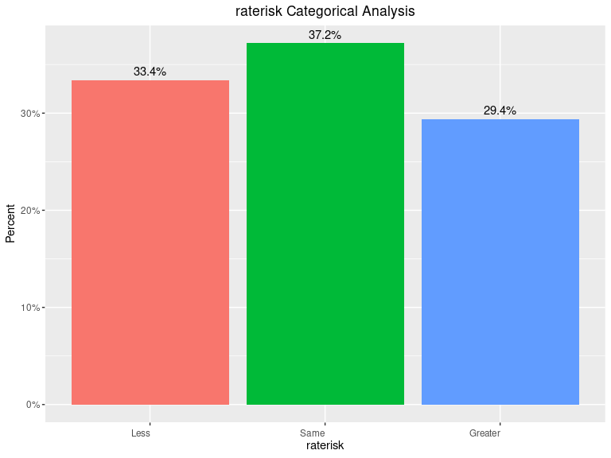

MSDS_6372_Project2
================
Tamas Toth
2022-07-22

#### Loading the necessary R libraries for the analysis

``` r
# Load the necessary libraries
library(knitr)
library(rmarkdown)
# From class
library(GGally)
library(epitools)
library(MASS)
library(tidyverse)
library(car)
library(caret)
library(glmnet)
library(ROCR)
#Dasta set
library(aplore3)

# Other useful libraries
library(dplyr)
library(ggplot2)

#library(ggpubr)
#library(tidyr)
#library(plyr)
#library(ggthemes)
#library(e1071)
#library(class)
#library(stringr)
#library(sjPlot)
#library(data.table)
#library(reshape2)
#library(corrplot)
#library(naivebayes)
#library(egg)
#library(rworldmap)
#library(Hmisc)
#library(DataExplorer)
#library(selectiveInference)
#library(dlookr)
```

``` r
# Turn off scientific notation
options(scipen = 100, digits = 4)
```

## The Global Longitudinal Study of Osteoporosis in Women

### Objective: Assessing risk factors and predicting if a woman with osteoperosis will have a bone fracture within the first year after joining the study.

#### The study has enrolled over 60,000 women aged 55 and older in ten countries. The major goals of the study are to use the data to provide insights into the management of fracture risk, patient experience with prevention and treatment of fractures and distribution of risk factors among older women on an international scale over the follow up period. The outcome variable is any fracture in the first year of follow up. www.outcomes-umassmed.org/glow

## Objective 1 methodology:

1.  Understand the data
2.  EDA
3.  Feature Selection (Penalized Logistic Regression,
    Stepwise/forward/backward, Manual)
4.  Split the data to Training and Test set
5.  Fit Logistic Regression model
6.  Interpret the model, including hypothesis testing and confidence
    intervals
7.  Conclusion

#### Read the data

``` r
#Read the data
bonemed_df = glow_bonemed
attach(bonemed_df)
bonemed_df_sample = sample_n(bonemed_df, 5)
knitr::kable(bonemed_df_sample, "html")
```

<table>
<thead>
<tr>
<th style="text-align:right;">
sub_id
</th>
<th style="text-align:right;">
site_id
</th>
<th style="text-align:right;">
phy_id
</th>
<th style="text-align:left;">
priorfrac
</th>
<th style="text-align:right;">
age
</th>
<th style="text-align:right;">
weight
</th>
<th style="text-align:right;">
height
</th>
<th style="text-align:right;">
bmi
</th>
<th style="text-align:left;">
premeno
</th>
<th style="text-align:left;">
momfrac
</th>
<th style="text-align:left;">
armassist
</th>
<th style="text-align:left;">
smoke
</th>
<th style="text-align:left;">
raterisk
</th>
<th style="text-align:right;">
fracscore
</th>
<th style="text-align:left;">
fracture
</th>
<th style="text-align:left;">
bonemed
</th>
<th style="text-align:left;">
bonemed_fu
</th>
<th style="text-align:left;">
bonetreat
</th>
</tr>
</thead>
<tbody>
<tr>
<td style="text-align:right;">
422
</td>
<td style="text-align:right;">
2
</td>
<td style="text-align:right;">
64
</td>
<td style="text-align:left;">
Yes
</td>
<td style="text-align:right;">
67
</td>
<td style="text-align:right;">
71.7
</td>
<td style="text-align:right;">
160
</td>
<td style="text-align:right;">
28.01
</td>
<td style="text-align:left;">
No
</td>
<td style="text-align:left;">
No
</td>
<td style="text-align:left;">
No
</td>
<td style="text-align:left;">
No
</td>
<td style="text-align:left;">
Greater
</td>
<td style="text-align:right;">
3
</td>
<td style="text-align:left;">
Yes
</td>
<td style="text-align:left;">
No
</td>
<td style="text-align:left;">
Yes
</td>
<td style="text-align:left;">
No
</td>
</tr>
<tr>
<td style="text-align:right;">
354
</td>
<td style="text-align:right;">
2
</td>
<td style="text-align:right;">
82
</td>
<td style="text-align:left;">
Yes
</td>
<td style="text-align:right;">
76
</td>
<td style="text-align:right;">
88.5
</td>
<td style="text-align:right;">
166
</td>
<td style="text-align:right;">
32.12
</td>
<td style="text-align:left;">
No
</td>
<td style="text-align:left;">
No
</td>
<td style="text-align:left;">
Yes
</td>
<td style="text-align:left;">
No
</td>
<td style="text-align:left;">
Less
</td>
<td style="text-align:right;">
7
</td>
<td style="text-align:left;">
No
</td>
<td style="text-align:left;">
No
</td>
<td style="text-align:left;">
No
</td>
<td style="text-align:left;">
No
</td>
</tr>
<tr>
<td style="text-align:right;">
306
</td>
<td style="text-align:right;">
4
</td>
<td style="text-align:right;">
282
</td>
<td style="text-align:left;">
No
</td>
<td style="text-align:right;">
62
</td>
<td style="text-align:right;">
70.3
</td>
<td style="text-align:right;">
159
</td>
<td style="text-align:right;">
27.81
</td>
<td style="text-align:left;">
No
</td>
<td style="text-align:left;">
No
</td>
<td style="text-align:left;">
No
</td>
<td style="text-align:left;">
No
</td>
<td style="text-align:left;">
Same
</td>
<td style="text-align:right;">
1
</td>
<td style="text-align:left;">
No
</td>
<td style="text-align:left;">
No
</td>
<td style="text-align:left;">
No
</td>
<td style="text-align:left;">
No
</td>
</tr>
<tr>
<td style="text-align:right;">
303
</td>
<td style="text-align:right;">
5
</td>
<td style="text-align:right;">
296
</td>
<td style="text-align:left;">
No
</td>
<td style="text-align:right;">
80
</td>
<td style="text-align:right;">
59.0
</td>
<td style="text-align:right;">
158
</td>
<td style="text-align:right;">
23.63
</td>
<td style="text-align:left;">
No
</td>
<td style="text-align:left;">
No
</td>
<td style="text-align:left;">
No
</td>
<td style="text-align:left;">
No
</td>
<td style="text-align:left;">
Same
</td>
<td style="text-align:right;">
5
</td>
<td style="text-align:left;">
No
</td>
<td style="text-align:left;">
Yes
</td>
<td style="text-align:left;">
Yes
</td>
<td style="text-align:left;">
Yes
</td>
</tr>
<tr>
<td style="text-align:right;">
91
</td>
<td style="text-align:right;">
3
</td>
<td style="text-align:right;">
141
</td>
<td style="text-align:left;">
Yes
</td>
<td style="text-align:right;">
87
</td>
<td style="text-align:right;">
61.2
</td>
<td style="text-align:right;">
160
</td>
<td style="text-align:right;">
23.91
</td>
<td style="text-align:left;">
No
</td>
<td style="text-align:left;">
Yes
</td>
<td style="text-align:left;">
Yes
</td>
<td style="text-align:left;">
No
</td>
<td style="text-align:left;">
Greater
</td>
<td style="text-align:right;">
10
</td>
<td style="text-align:left;">
No
</td>
<td style="text-align:left;">
Yes
</td>
<td style="text-align:left;">
Yes
</td>
<td style="text-align:left;">
Yes
</td>
</tr>
</tbody>
</table>

``` r
dim(bonemed_df)
```

    ## [1] 500  18

### Data Description

-   **sub_id**: Identification Code (1 - n)

-   **site_id**: Study Site (1 - 6)

-   **phy_id**: Physician ID code (128 unique codes)

-   **priorfrac**: History of Prior Fracture (1: No, 2: Yes)

-   **age**: Age at Enrollment (Years)

-   **weight**: Weight at enrollment (Kilograms)

-   **height**: Height at enrollment (Centimeters)

-   **bmi**: Body Mass Index (Kg/m^2)

-   **premeno**: Menopause before age 45 (1: No, 2: Yes)

-   **momfrac**: Mother had hip fracture (1: No, 2: Yes)

-   **armassist**: Arms are needed to stand from a chair (1: No, 2: Yes)

-   **smoke**: Former or current smoker (1: No, 2: Yes)

-   **raterisk**: Self-reported risk of fracture (1: Less than others of
    the same age, 2: Same as others of the same age, 3: Greater than
    others of the same age)

-   **fracscore**: Fracture Risk Score (Composite Risk Score)

-   **fracture**: Any fracture in first year (1: No, 2: Yes)

-   **bonemed**: Bone medications at enrollment (1: No, 2: Yes)

-   **bonemed_fu**: Bone medications at follow-up (1: No, 2: Yes)

-   **bonetreat**: Bone medications both at enrollment and follow-up (1:
    No, 2: Yes)

``` r
#set random seed
set.seed(329)
```

#### Address the missing values in each column (NA as well as empty strings).

``` r
# Address the missing values in each column (NA as well as empty strings).
missing_df = as.data.frame(sapply(bonemed_df, function(x) sum(is.na(x))))
colnames(missing_df) = c("missing values")
knitr::kable(missing_df, "html")
```

<table>
<thead>
<tr>
<th style="text-align:left;">
</th>
<th style="text-align:right;">
missing values
</th>
</tr>
</thead>
<tbody>
<tr>
<td style="text-align:left;">
sub_id
</td>
<td style="text-align:right;">
0
</td>
</tr>
<tr>
<td style="text-align:left;">
site_id
</td>
<td style="text-align:right;">
0
</td>
</tr>
<tr>
<td style="text-align:left;">
phy_id
</td>
<td style="text-align:right;">
0
</td>
</tr>
<tr>
<td style="text-align:left;">
priorfrac
</td>
<td style="text-align:right;">
0
</td>
</tr>
<tr>
<td style="text-align:left;">
age
</td>
<td style="text-align:right;">
0
</td>
</tr>
<tr>
<td style="text-align:left;">
weight
</td>
<td style="text-align:right;">
0
</td>
</tr>
<tr>
<td style="text-align:left;">
height
</td>
<td style="text-align:right;">
0
</td>
</tr>
<tr>
<td style="text-align:left;">
bmi
</td>
<td style="text-align:right;">
0
</td>
</tr>
<tr>
<td style="text-align:left;">
premeno
</td>
<td style="text-align:right;">
0
</td>
</tr>
<tr>
<td style="text-align:left;">
momfrac
</td>
<td style="text-align:right;">
0
</td>
</tr>
<tr>
<td style="text-align:left;">
armassist
</td>
<td style="text-align:right;">
0
</td>
</tr>
<tr>
<td style="text-align:left;">
smoke
</td>
<td style="text-align:right;">
0
</td>
</tr>
<tr>
<td style="text-align:left;">
raterisk
</td>
<td style="text-align:right;">
0
</td>
</tr>
<tr>
<td style="text-align:left;">
fracscore
</td>
<td style="text-align:right;">
0
</td>
</tr>
<tr>
<td style="text-align:left;">
fracture
</td>
<td style="text-align:right;">
0
</td>
</tr>
<tr>
<td style="text-align:left;">
bonemed
</td>
<td style="text-align:right;">
0
</td>
</tr>
<tr>
<td style="text-align:left;">
bonemed_fu
</td>
<td style="text-align:right;">
0
</td>
</tr>
<tr>
<td style="text-align:left;">
bonetreat
</td>
<td style="text-align:right;">
0
</td>
</tr>
</tbody>
</table>

``` r
empty_string_df = as.data.frame(sapply(bonemed_df, function(x) sum(x == "")))
colnames(empty_string_df) = c("empty string")
knitr::kable(empty_string_df, "html")
```

<table>
<thead>
<tr>
<th style="text-align:left;">
</th>
<th style="text-align:right;">
empty string
</th>
</tr>
</thead>
<tbody>
<tr>
<td style="text-align:left;">
sub_id
</td>
<td style="text-align:right;">
0
</td>
</tr>
<tr>
<td style="text-align:left;">
site_id
</td>
<td style="text-align:right;">
0
</td>
</tr>
<tr>
<td style="text-align:left;">
phy_id
</td>
<td style="text-align:right;">
0
</td>
</tr>
<tr>
<td style="text-align:left;">
priorfrac
</td>
<td style="text-align:right;">
0
</td>
</tr>
<tr>
<td style="text-align:left;">
age
</td>
<td style="text-align:right;">
0
</td>
</tr>
<tr>
<td style="text-align:left;">
weight
</td>
<td style="text-align:right;">
0
</td>
</tr>
<tr>
<td style="text-align:left;">
height
</td>
<td style="text-align:right;">
0
</td>
</tr>
<tr>
<td style="text-align:left;">
bmi
</td>
<td style="text-align:right;">
0
</td>
</tr>
<tr>
<td style="text-align:left;">
premeno
</td>
<td style="text-align:right;">
0
</td>
</tr>
<tr>
<td style="text-align:left;">
momfrac
</td>
<td style="text-align:right;">
0
</td>
</tr>
<tr>
<td style="text-align:left;">
armassist
</td>
<td style="text-align:right;">
0
</td>
</tr>
<tr>
<td style="text-align:left;">
smoke
</td>
<td style="text-align:right;">
0
</td>
</tr>
<tr>
<td style="text-align:left;">
raterisk
</td>
<td style="text-align:right;">
0
</td>
</tr>
<tr>
<td style="text-align:left;">
fracscore
</td>
<td style="text-align:right;">
0
</td>
</tr>
<tr>
<td style="text-align:left;">
fracture
</td>
<td style="text-align:right;">
0
</td>
</tr>
<tr>
<td style="text-align:left;">
bonemed
</td>
<td style="text-align:right;">
0
</td>
</tr>
<tr>
<td style="text-align:left;">
bonemed_fu
</td>
<td style="text-align:right;">
0
</td>
</tr>
<tr>
<td style="text-align:left;">
bonetreat
</td>
<td style="text-align:right;">
0
</td>
</tr>
</tbody>
</table>

``` r
# Function to Identify different characteristics of the data frame 
# Getting a concise summary of the dataframe: str()
# Listing the column labels of the dataframe: colnames()
# Size of the dataset: dim()
# # Verify if there is any negative values in the dataset
dfinfo = function(df_name)
  {
  df_structure = str(df_name)
  df_colnames = colnames(df_name)
  df_dimensions = dim(df_name)
  
  num_cols = bonemed_df %>% dplyr::select(where(is.numeric)) %>% colnames()
  df_neg = print(paste("Negative values in the variable:",  
                       sapply(bonemed_df[,num_cols], function(x) sum(x < 0))))
  
  outparam = list(df_structure, df_colnames, df_dimensions, df_neg)
  return (outparam)
}
```

``` r
dfinfo(bonemed_df)
```

    ## 'data.frame':    500 obs. of  18 variables:
    ##  $ sub_id    : int  1 2 3 4 5 6 7 8 9 10 ...
    ##  $ site_id   : int  1 4 6 6 1 5 5 1 1 4 ...
    ##  $ phy_id    : int  14 284 305 309 37 299 302 36 8 282 ...
    ##  $ priorfrac : Factor w/ 2 levels "No","Yes": 1 1 2 1 1 2 1 2 2 1 ...
    ##  $ age       : int  62 65 88 82 61 67 84 82 86 58 ...
    ##  $ weight    : num  70.3 87.1 50.8 62.1 68 68 50.8 40.8 62.6 63.5 ...
    ##  $ height    : int  158 160 157 160 152 161 150 153 156 166 ...
    ##  $ bmi       : num  28.2 34 20.6 24.3 29.4 ...
    ##  $ premeno   : Factor w/ 2 levels "No","Yes": 1 1 1 1 1 1 1 1 1 1 ...
    ##  $ momfrac   : Factor w/ 2 levels "No","Yes": 1 1 2 1 1 1 1 1 1 1 ...
    ##  $ armassist : Factor w/ 2 levels "No","Yes": 1 1 2 1 1 1 1 1 1 1 ...
    ##  $ smoke     : Factor w/ 2 levels "No","Yes": 1 1 1 1 1 2 1 1 1 1 ...
    ##  $ raterisk  : Factor w/ 3 levels "Less","Same",..: 2 2 1 1 2 2 1 2 2 1 ...
    ##  $ fracscore : int  1 2 11 5 1 4 6 7 7 0 ...
    ##  $ fracture  : Factor w/ 2 levels "No","Yes": 1 1 1 1 1 1 1 1 1 1 ...
    ##  $ bonemed   : Factor w/ 2 levels "No","Yes": 1 1 1 1 1 1 1 2 1 1 ...
    ##  $ bonemed_fu: Factor w/ 2 levels "No","Yes": 1 1 1 1 1 1 1 2 1 1 ...
    ##  $ bonetreat : Factor w/ 2 levels "No","Yes": 1 1 1 1 1 1 1 2 1 1 ...
    ## [1] "Negative values in the variable: 0" "Negative values in the variable: 0"
    ## [3] "Negative values in the variable: 0" "Negative values in the variable: 0"
    ## [5] "Negative values in the variable: 0" "Negative values in the variable: 0"
    ## [7] "Negative values in the variable: 0" "Negative values in the variable: 0"

    ## [[1]]
    ## NULL
    ## 
    ## [[2]]
    ##  [1] "sub_id"     "site_id"    "phy_id"     "priorfrac"  "age"       
    ##  [6] "weight"     "height"     "bmi"        "premeno"    "momfrac"   
    ## [11] "armassist"  "smoke"      "raterisk"   "fracscore"  "fracture"  
    ## [16] "bonemed"    "bonemed_fu" "bonetreat" 
    ## 
    ## [[3]]
    ## [1] 500  18
    ## 
    ## [[4]]
    ## [1] "Negative values in the variable: 0" "Negative values in the variable: 0"
    ## [3] "Negative values in the variable: 0" "Negative values in the variable: 0"
    ## [5] "Negative values in the variable: 0" "Negative values in the variable: 0"
    ## [7] "Negative values in the variable: 0" "Negative values in the variable: 0"

### Observations:

-   The data set is comprised of 500 observations and 18 variables
-   There are numerical and categorical variables in the data set
-   There are no missing values or empty strings in the data set
-   No negative values in the data set
-   ??????No duplicated records
-   ‘fracture’ is the dependent variable

##################################################################################### 

# Exploratory Data Analysis

##################################################################################### 

``` r
num_cols = bonemed_df %>% dplyr::select(where(is.numeric)) %>% colnames()
pair_plot = c(num_cols, 'fracture')
pair_plot = pair_plot[-1]
ggpairs(bonemed_df[,pair_plot],aes(color=fracture, alpha = 0.5))
```


### Observations:

-   Height for fracture ‘No’ and ‘Yes’ levels seem to be normally
    distributed.
-   Weight and bmi are strongly positively linearly correlated for both
    factor levels.
-   Age and fracscore are strongly positively linearly correlated for
    both factor levels.
-   There are more “No” fracture in the first year observations than
    “Yes”

``` r
# Summary statistics
t(aggregate(.~ fracture,data=bonemed_df,summary))
```

    ##                    [,1]     [,2]    
    ## fracture           "No"     "Yes"   
    ## sub_id.Min.        "  1.0"  "376.0" 
    ## sub_id.1st Qu.     " 94.5"  "407.0" 
    ## sub_id.Median      "188.0"  "438.0" 
    ## sub_id.Mean        "188.0"  "438.0" 
    ## sub_id.3rd Qu.     "281.5"  "469.0" 
    ## sub_id.Max.        "375.0"  "500.0" 
    ## site_id.Min.       "1.000"  "1.000" 
    ## site_id.1st Qu.    "2.000"  "2.000" 
    ## site_id.Median     "3.000"  "4.000" 
    ## site_id.Mean       "3.363"  "3.656" 
    ## site_id.3rd Qu.    "5.000"  "5.000" 
    ## site_id.Max.       "6.000"  "6.000" 
    ## phy_id.Min.        "  1.0"  "  7.0" 
    ## phy_id.1st Qu.     " 50.0"  " 68.0" 
    ## phy_id.Median      "172.0"  "197.0" 
    ## phy_id.Mean        "173.9"  "192.5" 
    ## phy_id.3rd Qu.     "296.0"  "300.0" 
    ## phy_id.Max.        "325.0"  "325.0" 
    ## priorfrac.Min.     "1.000"  "1.000" 
    ## priorfrac.1st Qu.  "1.000"  "1.000" 
    ## priorfrac.Median   "1.000"  "1.000" 
    ## priorfrac.Mean     "1.197"  "1.416" 
    ## priorfrac.3rd Qu.  "1.000"  "2.000" 
    ## priorfrac.Max.     "2.000"  "2.000" 
    ## age.Min.           "55.00"  "56.00" 
    ## age.1st Qu.        "60.00"  "65.00" 
    ## age.Median         "66.00"  "72.00" 
    ## age.Mean           "67.49"  "71.79" 
    ## age.3rd Qu.        "74.00"  "79.00" 
    ## age.Max.           "90.00"  "89.00" 
    ## weight.Min.        " 39.90" " 45.80"
    ## weight.1st Qu.     " 60.30" " 59.90"
    ## weight.Median      " 68.00" " 68.00"
    ## weight.Mean        " 72.17" " 70.79"
    ## weight.3rd Qu.     " 81.60" " 79.40"
    ## weight.Max.        "127.00" "124.70"
    ## height.Min.        "142.0"  "134.0" 
    ## height.1st Qu.     "158.0"  "155.0" 
    ## height.Median      "162.0"  "160.0" 
    ## height.Mean        "161.9"  "159.9" 
    ## height.3rd Qu.     "166.0"  "164.0" 
    ## height.Max.        "199.0"  "178.0" 
    ## bmi.Min.           "14.88"  "17.04" 
    ## bmi.1st Qu.        "23.32"  "23.05" 
    ## bmi.Median         "26.37"  "26.43" 
    ## bmi.Mean           "27.50"  "27.71" 
    ## bmi.3rd Qu.        "30.62"  "31.09" 
    ## bmi.Max.           "49.08"  "44.04" 
    ## premeno.Min.       "1.000"  "1.000" 
    ## premeno.1st Qu.    "1.000"  "1.000" 
    ## premeno.Median     "1.000"  "1.000" 
    ## premeno.Mean       "1.192"  "1.200" 
    ## premeno.3rd Qu.    "1.000"  "1.000" 
    ## premeno.Max.       "2.000"  "2.000" 
    ## momfrac.Min.       "1.000"  "1.000" 
    ## momfrac.1st Qu.    "1.000"  "1.000" 
    ## momfrac.Median     "1.000"  "1.000" 
    ## momfrac.Mean       "1.109"  "1.192" 
    ## momfrac.3rd Qu.    "1.000"  "1.000" 
    ## momfrac.Max.       "2.000"  "2.000" 
    ## armassist.Min.     "1.000"  "1.000" 
    ## armassist.1st Qu.  "1.000"  "1.000" 
    ## armassist.Median   "1.000"  "2.000" 
    ## armassist.Mean     "1.333"  "1.504" 
    ## armassist.3rd Qu.  "2.000"  "2.000" 
    ## armassist.Max.     "2.000"  "2.000" 
    ## smoke.Min.         "1.000"  "1.000" 
    ## smoke.1st Qu.      "1.000"  "1.000" 
    ## smoke.Median       "1.000"  "1.000" 
    ## smoke.Mean         "1.075"  "1.056" 
    ## smoke.3rd Qu.      "1.000"  "1.000" 
    ## smoke.Max.         "2.000"  "2.000" 
    ## raterisk.Min.      "1.000"  "1.000" 
    ## raterisk.1st Qu.   "1.000"  "2.000" 
    ## raterisk.Median    "2.000"  "2.000" 
    ## raterisk.Mean      "1.891"  "2.168" 
    ## raterisk.3rd Qu.   "3.000"  "3.000" 
    ## raterisk.Max.      "3.000"  "3.000" 
    ## fracscore.Min.     " 0.000" " 0.000"
    ## fracscore.1st Qu.  " 1.500" " 3.000"
    ## fracscore.Median   " 3.000" " 5.000"
    ## fracscore.Mean     " 3.317" " 4.840"
    ## fracscore.3rd Qu.  " 5.000" " 7.000"
    ## fracscore.Max.     "11.000" " 9.000"
    ## bonemed.Min.       "1.000"  "1.000" 
    ## bonemed.1st Qu.    "1.000"  "1.000" 
    ## bonemed.Median     "1.000"  "1.000" 
    ## bonemed.Mean       "1.221"  "1.368" 
    ## bonemed.3rd Qu.    "1.000"  "2.000" 
    ## bonemed.Max.       "2.000"  "2.000" 
    ## bonemed_fu.Min.    "1.000"  "1.000" 
    ## bonemed_fu.1st Qu. "1.000"  "1.000" 
    ## bonemed_fu.Median  "1.000"  "1.000" 
    ## bonemed_fu.Mean    "1.229"  "1.424" 
    ## bonemed_fu.3rd Qu. "1.000"  "2.000" 
    ## bonemed_fu.Max.    "2.000"  "2.000" 
    ## bonetreat.Min.     "1.000"  "1.000" 
    ## bonetreat.1st Qu.  "1.000"  "1.000" 
    ## bonetreat.Median   "1.000"  "1.000" 
    ## bonetreat.Mean     "1.208"  "1.320" 
    ## bonetreat.3rd Qu.  "1.000"  "2.000" 
    ## bonetreat.Max.     "2.000"  "2.000"

### Observations:

-   The minimum age for “No” fracture in the first year is 55. The
    minimum age for “Yes” fracture in the first year is 56.

-   The maximum age for “No” fracture in the first year is 99. The
    maximum age for “Yes” fracture in the first year is 89.

-   The median age for “No” fracture in the first year is 66. The median
    age for “Yes” fracture in the first year is 72.

-   The mean age for “No” fracture in the first year is 67.49. The mean
    age for “Yes” fracture in the first year is 71.79.

-   Age is a likely is good predictor of fracture in the first year
    since there is a observable difference in median and mean age of
    having a fracture.

-   The minimum weight for “No” fracture in the first year is 39.9. The
    minimum weight for “Yes” fracture in the first year is 45.8.

-   The maximum weight for “No” fracture in the first year is 127. The
    maximum weight for “Yes” fracture in the first year is 124.7.

-   The median weight for “No” fracture in the first year is 68. The
    median weight for “Yes” fracture in the first year is 68.

-   The mean weight for “No” fracture in the first year is 72.17. The
    mean weight for “Yes” fracture in the first year is 70.79.

-   Weight does not seem to be a significant variable for predicting
    fracture in the first year as the median and mean weight values are
    very similar to the factor levels.

-   The minimum height for “No” fracture in the first year is 142. The
    minimum height for “Yes” fracture in the first year is 134.

-   The maximum height for “No” fracture in the first year is 199. The
    maximum height for “Yes” fracture in the first year is 178.

-   The median height for “No” fracture in the first year is 162. The
    median height for “Yes” fracture in the first year is 160.

-   The mean height for “No” fracture in the first year is 161.9. The
    mean height for “Yes” fracture in the first year is 159.9.

-   Height seems to be a good predictor for fracture in the first year.

-   The minimum bmi for “No” fracture in the first year is 14.88. The
    minimum bmi for “Yes” fracture in the first year is 17.04.

-   The maximum bmi for “No” fracture in the first year is 49.08 The
    maximum bmi for “Yes” fracture in the first year is 44.04.

-   The median bmi for “No” fracture in the first year is 26.37. The
    median bmi for “Yes” fracture in the first year is 26.43.

-   The mean bmi for “No” fracture in the first year is 27.50. The mean
    bmi for “Yes” fracture in the first year is 27.71.

-   BMI does not seem to be a significant predictor for fracture in the
    first year.

-   The minimum Fracture Risk Score for “No” fracture in the first year
    is 0. The minimum Fracture Risk Score for “Yes” fracture in the
    first year is 0.

-   The maximum Fracture Risk Score for “No” fracture in the first year
    is 11. The maximum Fracture Risk Score for “Yes” fracture in the
    first year is 9.

-   The median Fracture Risk Score for “No” fracture in the first year
    is 3. The median Fracture Risk Score for “Yes” fracture in the first
    year is 5.

-   The mean Fracture Risk Score for “No” fracture in the first year is
    3.317. The mean Fracture Risk Score for “Yes” fracture in the first
    year is 4.840.

-   Fracture Risk Score seems to be a significant predictor for fracture
    in the first year.

##################################################################################### 

# Categorical data plots

##################################################################################### 

``` r
cat_cols = bonemed_df %>% dplyr::select(where(is.factor)) %>% colnames()

# Plot all categorical variables
for (c in cat_cols)
{
  cat_plot = bonemed_df %>% ggplot(aes(x= .data[[c]], group = 1)) + 
    geom_bar(aes(y = ..prop.., fill = factor(..x..)), stat="count") +
    geom_text(aes( label = scales::percent(..prop..),
                   y= ..prop.. ), stat= "count", vjust = -.5) +
    labs(y = "Percent") +
    scale_y_continuous(labels = scales::percent) + theme(legend.position = "none") +
    ggtitle(paste(c, "Categorical Analysis")) + 
    theme(plot.title = element_text(hjust = 0.5)) + 
    theme(axis.text.x = element_text(vjust = 0.5, hjust=1)) # +
    egg::ggarrange(cat_plot, ncol=2) 
}
```



### Observations:

-   75% of the observations have no prior history of fracture. 25% of
    the observations have prior history of fracture.
-   81% of the observations have no menopause before age 45. 19% of the
    observations have menopause before age 45.
-   87% of the subjects’ mother had no hip fracture. 13% of the
    subjects’ mother had hip fracture.
-   62% of the subjects do not need arms to stand from a chair. 38% of
    the subjects need arms to stand from a chair.
-   93% of the subjects don’t smoke. 7% of the subjects smoke are former
    or current smoker.
-   33.4% of the subjects reported less risk of fractures than others of
    the same age. 37.2% of the subjects reported the same risk of
    fractures than others of the same age. 29.4% of the subjects
    reported greater risk of fractures than others of the same age.
-   75% of the patients do not have any fractures in first year. 25% of
    the patients have any fractures in first year.
-   74% of the subjects have enrolled to Bone medications. 26% of the
    subjects have not enrolled to Bone medications.
-   72% of the subjects did not require bone medications at follow-up.
    28% of the subjects required bone medications at follow-up.
-   76% of the patients did not receive bone medications at either
    enrollment or follow-up. 24% of the patients received bone
    medications both at enrollment and follow-up.

##################################################################################### 

# Bi-variate analysis with Fracture variable

##################################################################################### 

``` r
num_cols = bonemed_df %>% dplyr::select(where(is.numeric)) %>% colnames()
bivar_plot = num_cols[c(-1, -2, -3)]


for (i in bivar_plot)
{
multibox = bonemed_df %>%
  ggplot(aes(x=fracture, y = .data[[i]])) +
  geom_boxplot(fill = "sandybrown", color = "black") + 
  xlab("Fracture") +
  ylab(i) + stat_summary(fun=mean, geom="point", shape=20, size=7, color="red", fill="red") +
  ggtitle(paste(i, "vs Fracture bi-variate analysis")) +
  theme(plot.title = element_text(hjust = 0.5)) +
  scale_fill_brewer(palette = "Oranges")  
egg::ggarrange(multibox, ncol=2)
}
```


### Observations:

-   We can see an increasing in median and mean age for those who had
    any fractures in the first year.
-   Median and mean weight for both fracture levels are very similar.
-   The median and mean height are lower for those who had fracture in
    the first year. This is likely because the bone density is reduced
    and the subjects shrunk.
-   Median and mean BMI is very similar for both factor levels.
-   The mean and median fracture risk score is higher for those who had
    any fracture in the first year.

##################################################################################### 

# Loess plots

##################################################################################### 

``` r
bonemed_df$fracture.num<-ifelse(bonemed_df$fracture=="Yes",1,0)

num_cols = bonemed_df %>% dplyr::select(where(is.numeric)) %>% colnames()
loess_plot = num_cols[c(-1, -2, -3, -9)]

for (i in loess_plot)
{
loess = bonemed_df %>% 
ggplot(aes(x=.data[[i]],y=fracture.num))+
geom_point()+
geom_smooth(formula = y ~ x, method="loess")+
theme(plot.title = element_text(hjust = 0.5)) +
ggtitle(paste(i, "vs fracture loess smoothing"))
egg::ggarrange(loess, ncol=2)
}
```

<!-- --><!-- --><!-- --><!-- --><!-- -->

### Observations:

-   The Loess plots show the ‘age’, ‘height’ and ‘fracscore’ have an S
    curve like logistic model.

##################################################################################### 

# Feature Selection

##################################################################################### 

## Manual selection

``` r
# Fit each variable separately and check the p-value for significance

# priorfrac
simple.log.priorfrac<-glm(fracture~priorfrac,family="binomial",data=bonemed_df)
simple.log.priorfrac.sum = summary(simple.log.priorfrac)

# age
simple.log.age<-glm(fracture~age,family="binomial",data=bonemed_df)
simple.log.age.sum = summary(simple.log.age)

# weight
simple.log.weight<-glm(fracture~weight,family="binomial",data=bonemed_df)
simple.log.weight.sum = summary(simple.log.weight)

# height
simple.log.height<-glm(fracture~height,family="binomial",data=bonemed_df)
simple.log.height.sum = summary(simple.log.height)

# bmi
simple.log.bmi<-glm(fracture~bmi,family="binomial",data=bonemed_df)
simple.log.bmi.sum = summary(simple.log.bmi)

# premeno
simple.log.premeno<-glm(fracture~premeno,family="binomial",data=bonemed_df)
simple.log.premeno.sum = summary(simple.log.premeno)

# momfrac
simple.log.momfrac<-glm(fracture~momfrac,family="binomial",data=bonemed_df)
simple.log.momfrac.sum = summary(simple.log.momfrac)

# armassist
simple.log.armassist<-glm(fracture~armassist,family="binomial",data=bonemed_df)
simple.log.armassist.sum = summary(simple.log.armassist)

# smoke
simple.log.smoke<-glm(fracture~smoke,family="binomial",data=bonemed_df)
simple.log.smoke.sum = summary(simple.log.smoke)

# raterisk
simple.log.raterisk<-glm(fracture~raterisk,family="binomial",data=bonemed_df)
simple.log.raterisk.sum = summary(simple.log.raterisk)

# fracscore
simple.log.fracscore<-glm(fracture~fracscore,family="binomial",data=bonemed_df)
simple.log.fracscore.sum = summary(simple.log.fracscore)

# bonemed
simple.log.bonemed<-glm(fracture~bonemed,family="binomial",data=bonemed_df)
simple.log.bonemed.sum = summary(simple.log.bonemed)

# bonemed_fu
simple.log.bonemed_fu<-glm(fracture~bonemed_fu,family="binomial",data=bonemed_df)
simple.log.bonemed_fu.sum = summary(simple.log.bonemed_fu)

# bonetreat
simple.log.bonetreat<-glm(fracture~bonetreat,family="binomial",data=bonemed_df)
simple.log.bonetreat.sum = summary(simple.log.bonetreat)
```

``` r
# priorfrac
simple.log.priorfrac.sum$coefficients
```

    ##              Estimate Std. Error z value                         Pr(>|z|)
    ## (Intercept)    -1.417     0.1305 -10.859 0.000000000000000000000000001816
    ## priorfracYes    1.064     0.2231   4.769 0.000001853248040966234079623943

``` r
# age
simple.log.age.sum$coefficients
```

    ##             Estimate Std. Error z value       Pr(>|z|)
    ## (Intercept) -4.77885    0.82722  -5.777 0.000000007604
    ## age          0.05289    0.01163   4.548 0.000005418063

``` r
# weight
simple.log.weight.sum$coefficients
```

    ##              Estimate Std. Error z value Pr(>|z|)
    ## (Intercept) -0.727190   0.467776 -1.5546   0.1200
    ## weight      -0.005197   0.006415 -0.8101   0.4179

``` r
# height
simple.log.height.sum$coefficients
```

    ##             Estimate Std. Error z value Pr(>|z|)
    ## (Intercept)  7.21229    2.74378   2.629 0.008574
    ## height      -0.05167    0.01709  -3.022 0.002509

``` r
# bmi
simple.log.bmi.sum$coefficients
```

    ##              Estimate Std. Error z value Pr(>|z|)
    ## (Intercept) -1.257545    0.48636  -2.586  0.00972
    ## bmi          0.005758    0.01719   0.335  0.73760

``` r
# premeno
simple.log.premeno.sum$coefficients
```

    ##             Estimate Std. Error z value                    Pr(>|z|)
    ## (Intercept) -1.10856     0.1153 -9.6123 0.0000000000000000000007091
    ## premenoYes   0.05077     0.2592  0.1959 0.8447084924818586415540267

``` r
# momfrac
simple.log.momfrac.sum$coefficients
```

    ##             Estimate Std. Error z value                        Pr(>|z|)
    ## (Intercept)  -1.1960     0.1136 -10.532 0.00000000000000000000000006124
    ## momfracYes    0.6605     0.2810   2.351 0.01873927195290219296919254077

``` r
# armassist
simple.log.armassist.sum$coefficients
```

    ##              Estimate Std. Error z value                     Pr(>|z|)
    ## (Intercept)   -1.3943     0.1419  -9.828 0.00000000000000000000008553
    ## armassistYes   0.7091     0.2098   3.381 0.00072314553119062177817533

``` r
# smoke
simple.log.smoke.sum$coefficients
```

    ##             Estimate Std. Error  z value                      Pr(>|z|)
    ## (Intercept)  -1.0786     0.1066 -10.1218 0.000000000000000000000004424
    ## smokeYes     -0.3077     0.4358  -0.7059 0.480224577679933761764630162

``` r
# raterisk
simple.log.raterisk.sum$coefficients
```

    ##                 Estimate Std. Error z value            Pr(>|z|)
    ## (Intercept)      -1.6023     0.2071  -7.735 0.00000000000001034
    ## rateriskSame      0.5462     0.2664   2.050 0.04035609748515017
    ## rateriskGreater   0.9091     0.2711   3.353 0.00079977006892584

``` r
# fracscore
simple.log.fracscore.sum$coefficients
```

    ##             Estimate Std. Error z value                    Pr(>|z|)
    ## (Intercept)  -2.0988     0.2176  -9.646 0.0000000000000000000005135
    ## fracscore     0.2466     0.0433   5.696 0.0000000122467960824948465

``` r
# bonemed
simple.log.bonemed.sum$coefficients
```

    ##             Estimate Std. Error z value                      Pr(>|z|)
    ## (Intercept)  -1.3073     0.1268 -10.308 0.000000000000000000000000645
    ## bonemedYes    0.7171     0.2233   3.211 0.001321957055338154104345838

``` r
# bonemed_fu
simple.log.bonemed_fu.sum$coefficients
```

    ##               Estimate Std. Error z value                        Pr(>|z|)
    ## (Intercept)    -1.3898     0.1317 -10.551 0.00000000000000000000000005015
    ## bonemed_fuYes   0.9057     0.2187   4.141 0.00003463169646216865871137663

``` r
# bonetreat
simple.log.bonetreat.sum$coefficients
```

    ##              Estimate Std. Error z value                      Pr(>|z|)
    ## (Intercept)   -1.2511     0.1230 -10.170 0.000000000000000000000002686
    ## bonetreatYes   0.5833     0.2301   2.535 0.011256740718135330170390773

### Observations:

-   We can see that the following variables are statistically
    significant since p-value \< 0.05:

1.  priorfracYes
2.  age
3.  height
4.  momfracYes
5.  armassistYes
6.  rateriskGreater
7.  fracscore
8.  bonemedYes
9.  bonemed_fuYes
10. bonetreatYes

This result is in-line with what we have observed through EDA for the
continuous variables. Next, let’s fit all the variables and observe the
effect and see how it is changing the significance of the predictors.

``` r
multi_var.log<-glm(fracture~priorfrac+age+weight+height+bmi+premeno+momfrac+armassist+smoke+raterisk+fracscore+bonemed+
                     bonemed_fu+bonetreat,family="binomial",data=bonemed_df)
multi_var.log.sum = summary(multi_var.log)
multi_var.log.sum$coefficients
```

    ##                  Estimate Std. Error z value Pr(>|z|)
    ## (Intercept)     -17.07822   12.80864 -1.3333 0.182422
    ## priorfracYes      0.52585    0.39600  1.3279 0.184203
    ## age               0.01618    0.05629  0.2875 0.773714
    ## weight           -0.13254    0.08907 -1.4881 0.136733
    ## height            0.08019    0.08120  0.9875 0.323396
    ## bmi               0.36724    0.23143  1.5868 0.112547
    ## premenoYes        0.19494    0.29255  0.6663 0.505196
    ## momfracYes        0.61382    0.42858  1.4322 0.152082
    ## armassistYes      0.16779    0.61066  0.2748 0.783491
    ## smokeYes         -0.27693    0.54660 -0.5066 0.612408
    ## rateriskSame      0.36390    0.28982  1.2556 0.209261
    ## rateriskGreater   0.53726    0.31964  1.6808 0.092795
    ## fracscore         0.09721    0.28046  0.3466 0.728890
    ## bonemedYes        1.50963    0.65911  2.2904 0.021997
    ## bonemed_fuYes     1.61953    0.50153  3.2292 0.001242
    ## bonetreatYes     -2.66789    0.83779 -3.1844 0.001450

### Check VIF

``` r
vif(multi_var.log)
```

    ##               GVIF Df GVIF^(1/(2*Df))
    ## priorfrac    2.775  1           1.666
    ## age         20.655  1           4.545
    ## weight     171.941  1          13.113
    ## height      20.675  1           4.547
    ## bmi        160.101  1          12.653
    ## premeno      1.122  1           1.059
    ## momfrac      1.946  1           1.395
    ## armassist    7.285  1           2.699
    ## smoke        1.420  1           1.192
    ## raterisk     1.264  2           1.060
    ## fracscore   38.318  1           6.190
    ## bonemed      7.565  1           2.750
    ## bonemed_fu   4.548  1           2.133
    ## bonetreat   11.563  1           3.400

### Remove the multicollinearity

``` r
multi_var.log.vif<-glm(fracture~priorfrac+age+weight+height+premeno+momfrac+armassist+smoke+raterisk+fracscore+bonemed+
                     bonemed_fu+bonetreat,family="binomial",data=bonemed_df)
multi_var.log.vif.sum = summary(multi_var.log.vif)
multi_var.log.vif.sum$coefficients
```

    ##                  Estimate Std. Error  z value Pr(>|z|)
    ## (Intercept)      2.373360   4.109464  0.57754 0.563578
    ## priorfracYes     0.602625   0.391256  1.54023 0.123504
    ## age              0.035406   0.054942  0.64443 0.519297
    ## weight           0.007889   0.009061  0.87063 0.383956
    ## height          -0.046700   0.019497 -2.39525 0.016609
    ## premenoYes       0.238615   0.290430  0.82159 0.411309
    ## momfracYes       0.725737   0.423586  1.71332 0.086654
    ## armassistYes     0.373010   0.595385  0.62650 0.530986
    ## smokeYes        -0.201905   0.545194 -0.37034 0.711132
    ## rateriskSame     0.346782   0.288845  1.20058 0.229914
    ## rateriskGreater  0.527148   0.318587  1.65464 0.097997
    ## fracscore       -0.004079   0.272392 -0.01498 0.988052
    ## bonemedYes       1.518333   0.656173  2.31392 0.020672
    ## bonemed_fuYes    1.602526   0.503243  3.18440 0.001451
    ## bonetreatYes    -2.656385   0.836010 -3.17745 0.001486

### re-Check VIF

``` r
vif(multi_var.log.vif)
```

    ##              GVIF Df GVIF^(1/(2*Df))
    ## priorfrac   2.723  1           1.650
    ## age        19.836  1           4.454
    ## weight      1.854  1           1.362
    ## height      1.198  1           1.095
    ## premeno     1.111  1           1.054
    ## momfrac     1.889  1           1.375
    ## armassist   6.983  1           2.643
    ## smoke       1.416  1           1.190
    ## raterisk    1.259  2           1.059
    ## fracscore  36.353  1           6.029
    ## bonemed     7.547  1           2.747
    ## bonemed_fu  4.603  1           2.145
    ## bonetreat  11.588  1           3.404

### Observations:

-   Fitting all variables to the logistic regression model, it shows
    that only ‘bonmed’, ‘bonemed_fu’ and ‘bonetreat’ are statistically
    significant.
-   We observed multicollinearity between ‘weight’ and ‘bmi’. We removed
    the ‘bmi’ variable and re-run the logistic regression model.
-   As a result the following variables are statistically significant:

1.  height
2.  bonemed
3.  bonemed_fu
4.  bonetreat

Let’s test other feature selection methods as well.

## Stepwise selection

``` r
bonemed_df.step = bonemed_df[,c('priorfrac', 'age', 'weight', 'height', 'bmi', 'premeno', 'momfrac', 'armassist', 'smoke', 'raterisk', 'fracscore', 
                                'bonemed', 'bonemed_fu', 'bonetreat', 'fracture')]
step.full.log = glm(fracture~.,family="binomial",data=bonemed_df.step)
step.log = step.full.log %>% stepAIC(trace=FALSE)
```

``` r
summary(step.log)
```

    ## 
    ## Call:
    ## glm(formula = fracture ~ priorfrac + weight + bmi + momfrac + 
    ##     fracscore + bonemed + bonemed_fu + bonetreat, family = "binomial", 
    ##     data = bonemed_df.step)
    ## 
    ## Deviance Residuals: 
    ##     Min       1Q   Median       3Q      Max  
    ## -1.6420  -0.7361  -0.5341  -0.0395   2.2592  
    ## 
    ## Coefficients:
    ##               Estimate Std. Error z value  Pr(>|z|)    
    ## (Intercept)    -3.1001     0.6378   -4.86 0.0000012 ***
    ## priorfracYes    0.4979     0.2686    1.85   0.06374 .  
    ## weight         -0.0451     0.0200   -2.26   0.02396 *  
    ## bmi             0.1460     0.0539    2.71   0.00671 ** 
    ## momfracYes      0.6270     0.3145    1.99   0.04620 *  
    ## fracscore       0.1626     0.0529    3.07   0.00212 ** 
    ## bonemedYes      1.4823     0.6614    2.24   0.02502 *  
    ## bonemed_fuYes   1.7362     0.4878    3.56   0.00037 ***
    ## bonetreatYes   -2.6247     0.8368   -3.14   0.00171 ** 
    ## ---
    ## Signif. codes:  0 '***' 0.001 '**' 0.01 '*' 0.05 '.' 0.1 ' ' 1
    ## 
    ## (Dispersion parameter for binomial family taken to be 1)
    ## 
    ##     Null deviance: 562.34  on 499  degrees of freedom
    ## Residual deviance: 493.78  on 491  degrees of freedom
    ## AIC: 511.8
    ## 
    ## Number of Fisher Scoring iterations: 4

``` r
exp(cbind("Odds ratio" = coef(step.log), confint.default(step.log, level = 0.95)))
```

    ##               Odds ratio   2.5 %  97.5 %
    ## (Intercept)      0.04505 0.01291  0.1572
    ## priorfracYes     1.64526 0.97194  2.7850
    ## weight           0.95594 0.91927  0.9941
    ## bmi              1.15721 1.04128  1.2860
    ## momfracYes       1.87192 1.01062  3.4673
    ## fracscore        1.17658 1.06067  1.3052
    ## bonemedYes       4.40320 1.20438 16.0980
    ## bonemed_fuYes    5.67572 2.18154 14.7665
    ## bonetreatYes     0.07246 0.01406  0.3736

``` r
vif(step.log)
```

    ##  priorfrac     weight        bmi    momfrac  fracscore    bonemed bonemed_fu 
    ##      1.294      9.063      8.874      1.058      1.369      7.698      4.355 
    ##  bonetreat 
    ##     11.668

## Obseravtions:

-   Running a stepwise selection to identify the most important
    predictors the

##################################################################################### 

# Prediction

##################################################################################### 

##################################################################################### 

# Split the Data to Train and Test sets (85%-15%)

##################################################################################### 

``` r
index<-sample(1:dim(bonemed_df)[1],round(dim(bonemed_df)[1]*0.85),replace=F)
train = bonemed_df[index,]
test = bonemed_df[-index,]
```
